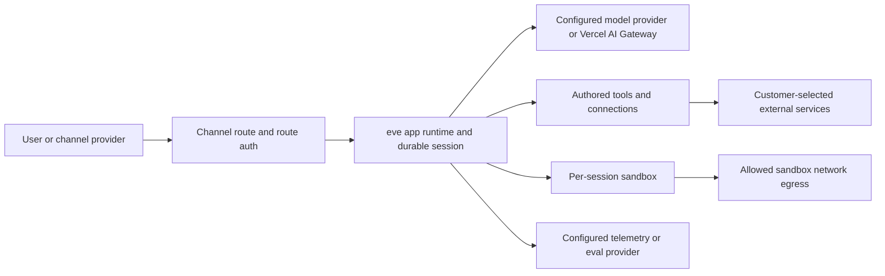

eve runs trusted application code separately from model-controlled sandbox work. Keep credentials in the app runtime and expose only the operations the agent needs.

## Trust boundaries

|                         | App runtime  | Sandbox               |
| ----------------------- | ------------ | --------------------- |
| `process.env` / secrets | Yes          | No                    |
| Your Node.js code       | Yes          | No                    |
| Network                 | Unrestricted | Controlled by policy  |
| Filesystem              | App's own    | Isolated `/workspace` |

The app runtime is the trusted side. Your tool implementations, model calls, connections, state, and durable execution all run here, with `process.env` and full Node.js available. (On Vercel, this is a Vercel Function.)

The sandbox provides an isolated `/workspace` without app secrets or `process.env`. Built-in tools such as `bash`, `read_file`, and `write_file` run in the app runtime and proxy commands or file access into it. On Vercel, the sandbox is a [Vercel Sandbox](https://vercel.com/docs/sandbox) microVM. The model sees tool definitions and returned results, not credentials.

For example, a custom `charge_card` tool can read `process.env.STRIPE_KEY` in the app runtime and return `{ ok: true }` to the model without sending the key to the sandbox. The built-in `write_file` instead proxies a write into `/workspace`.

See [Agent loop and sandbox](./execution-model-and-durability#agent-loop-and-sandbox) for how eve connects these contexts while keeping their state and lifetimes separate.

## Data flow at a glance

eve sends data where your agent configuration and runtime choices send it:

- Inbound channel data flows through the channel provider you configure, then into the eve app runtime.
- Model inputs and outputs flow to the model or routing path selected in `agent.ts`, such as a Vercel AI Gateway model id or a provider-authored `LanguageModel`.
- Tool and connection calls flow to the external services, MCP servers, OpenAPI endpoints, and channels you configure.
- Sandbox commands can reach network destinations allowed by the sandbox network policy.
- Telemetry flows to destinations configured under `agent/instrumentation/`.
  eve also records local traces during `eve dev` and exports to Vercel Agent
  Runs in preview and production by default. Eval data flows to the reporters
  configured in eval settings.

eve stores durable session and workflow state needed to resume conversations, stream events, replay completed steps, and show run observability. You are responsible for deciding whether the selected channels, model providers, connected services, sandbox egress destinations, telemetry exporters, retention settings, and deletion controls are appropriate for your data and use case.

## Credential brokering

Credential brokering gives the model _authenticated_ network access from inside the sandbox, like a `git clone` of a private repo or an authenticated `curl`, when there's no [tool](../tools) or [connection](../connections) to route it through. On the Vercel Sandbox backend, auth headers get injected at the sandbox's network firewall for matching domains. The secret stays in the app runtime; the sandbox process only ever sees the response. See [Vercel Sandbox Credential Brokering](https://vercel.com/docs/sandbox/concepts/firewall#credentials-brokering) for the platform mechanism, and [Sandbox](../sandbox) for the eve policy API.

## Connection credentials

[Connection](../connections) tokens (MCP and OpenAPI) come from either `getToken()` or an interactive OAuth flow, and eve injects the resolved token into every outbound request. The token is cached per step and never serialized to durable state.

## Channel verification

A [channel](../channels/overview) is your agent's front door, so authenticating inbound traffic is its job. The built-in platform channels follow two rules, and so must any channel you write yourself:

- **Verify signatures in constant time.** Platform channels (Slack, GitHub,
  Telegram, Twilio) verify the platform's HMAC signature over the raw request body
  with a constant-time comparison, so timing the response can't reveal a forged
  signature. Use a constant-time compare for any secret you check, never `===` on
  a signature.
- **Don't trust body-supplied identity.** Derive the caller from a _verified_
  signature or token, never from a `principalId` (or similar) the request body
  claims. A body field is attacker-controlled; treating it as identity is
  cross-user impersonation.

## Authored markdown is data

[Skill](../skills) and [schedule](../schedules) files are markdown with YAML frontmatter, and eve treats that frontmatter strictly as data. The code-capable engines (`---js` / `---javascript`, which would `eval()` the frontmatter body the moment the file is parsed) are disabled, so such a fence throws rather than running. Frontmatter has to parse to a plain YAML object.

## Auth fails closed

Routes reject unauthenticated traffic by default. If no `AuthFn` in the walk accepts the request, it gets a `401`, and admitting anonymous callers takes an explicit `none()`. The scaffold's `placeholderAuth()` keeps a half-configured app closed in production until you replace it. See [Auth & route protection](../guides/auth-and-route-protection) for the full walk and verifiers.

## Pre-production checklist

Before exposing an agent to real traffic:

- [ ] Replace `placeholderAuth()` in `agent/channels/eve.ts` with a real
      `AuthFn` (`vercelOidc()`, `httpBasic()`, `oidc()`, or your own). Verify an
      unauthenticated production request gets `401`.
- [ ] Verify channel signatures. Each platform channel needs its signing
      secret set; custom channels must verify signatures in constant time and never
      trust body-supplied identity.
- [ ] Keep secrets in `process.env`, never in compiled artifacts, never
      passed into the sandbox. Route privileged calls through tools or connections.
- [ ] Scope connection tokens to the least privilege the agent needs; they
      reach hosts but never the model.
- [ ] Set a sandbox network policy tighter than `allow-all` if the model
      shouldn't have open egress; use credential brokering for authenticated egress.
- [ ] Don't surface untrusted text as markup. Model- or user-controlled
      strings rendered into a channel UI should be escaped for that surface.

## What to read next

- [Auth & route protection](../guides/auth-and-route-protection): the full auth walk and verifier helpers
- [Sandbox](../sandbox): backends, network policy, and brokering config
- [Execution model and durability](./execution-model-and-durability): how durable sessions run
- [Connections](../connections): static-token and OAuth connections
- [Responsible use](../responsible-use): deployer responsibilities and safeguards to review before production
