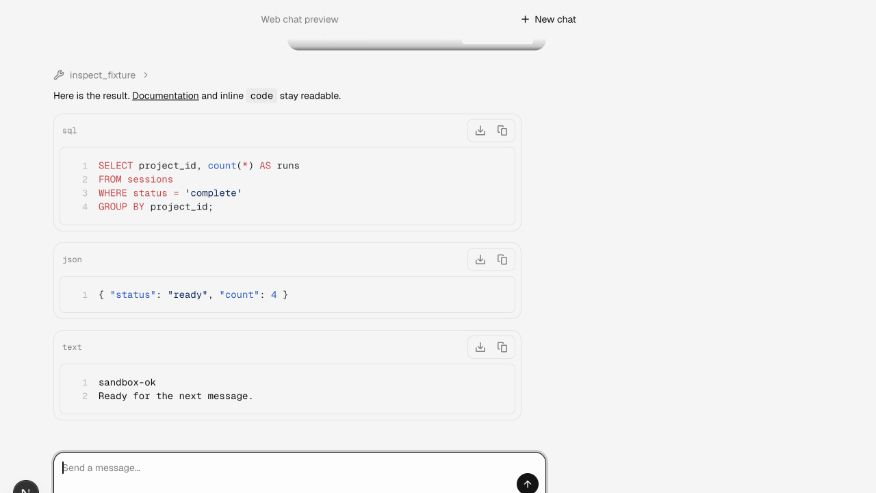
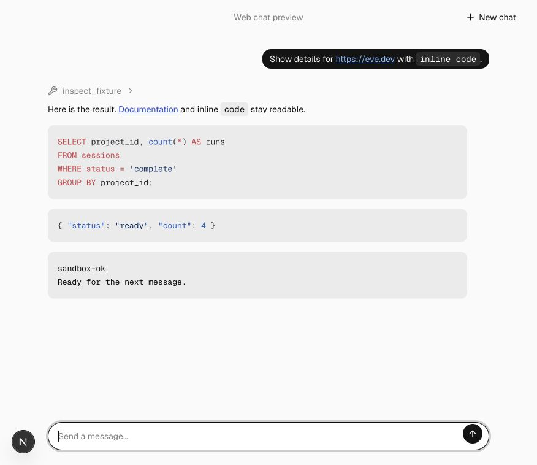
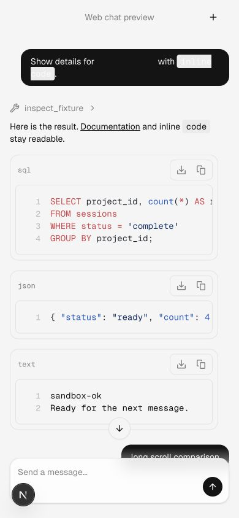
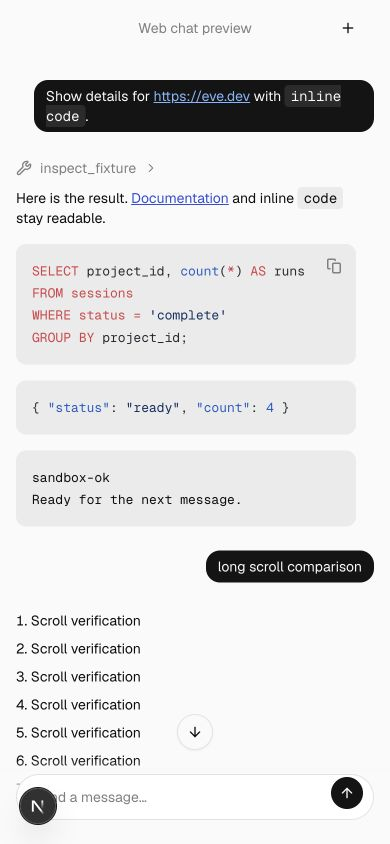

# Conversation presentation

User links, inline code, SQL, JSON and plain text render with less chrome. User bubbles use 14px corners and 6px/12px padding; the composer starts at one line and stays at the bottom with a measured 4px content gap.

## Comparison

| Viewport                  | Before                                | After                               |
| ------------------------- | ------------------------------------- | ----------------------------------- |
| Desktop, 876 × 758 CSS px |  |  |
| Mobile, 390 × 844 CSS px  |    |    |

Compared the same initial user message, generated SQL/JSON/text answer and compact composer. Both desktop and mobile captures are attached.

## Validation

Generated template parity, 65 scaffold integration tests, lint and focused formatting passed. The generated preview consumer passed its TypeScript check.

See the [reproduction notes](../README.md) for the deterministic fixture and common prerequisites. These are review captures, not visual-design approval.
