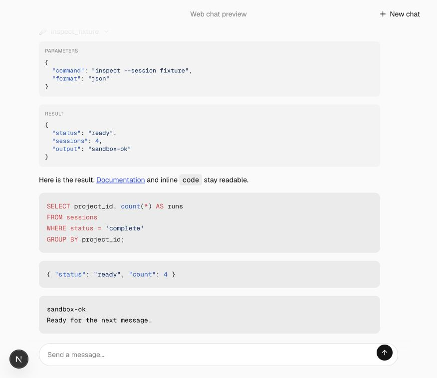
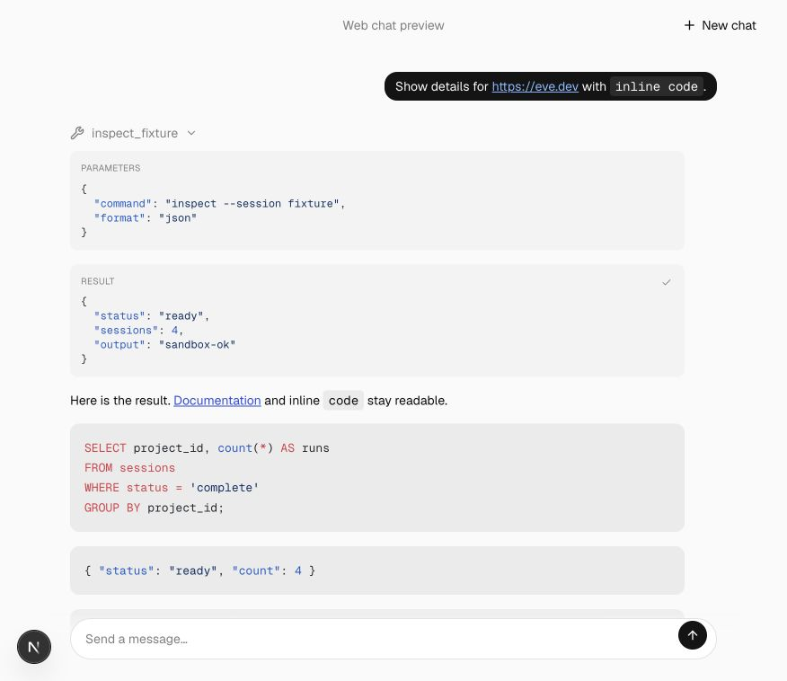
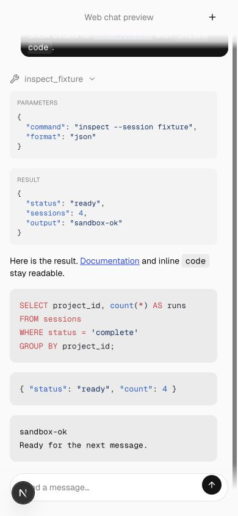
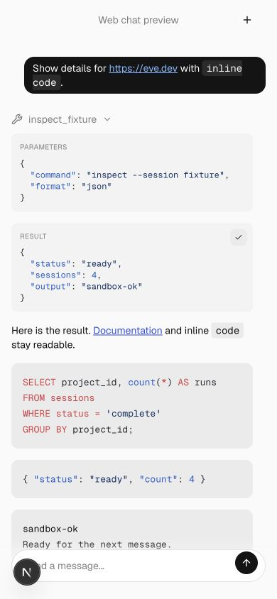

# Tool details and thinking

Tool parameters and results use the same copy control as command, output and error blocks. Thinking disclosures retain user choice and open by default; the shimmer keeps its sweep speed with a longer repeat interval.

## Comparison

| Viewport                  | Before                                | After                               |
| ------------------------- | ------------------------------------- | ----------------------------------- |
| Desktop, 876 × 758 CSS px |  |  |
| Mobile, 390 × 844 CSS px  |    |    |

Expanded inspect_fixture, copied parameters and result, and checked clipboard text. The after-mobile capture shows copy confirmation. Individual command and error clipboard paths were not separately exercised.

## Validation

Generated template parity, 65 scaffold integration tests, lint and focused formatting passed. The generated preview consumer passed its TypeScript check.

See the [reproduction notes](../README.md) for the deterministic fixture and common prerequisites. These are review captures, not visual-design approval.
