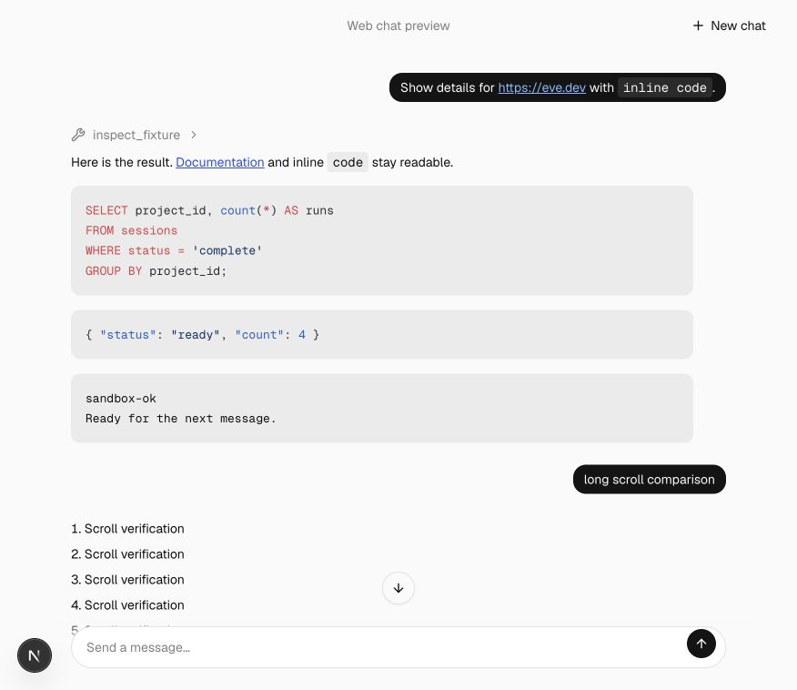
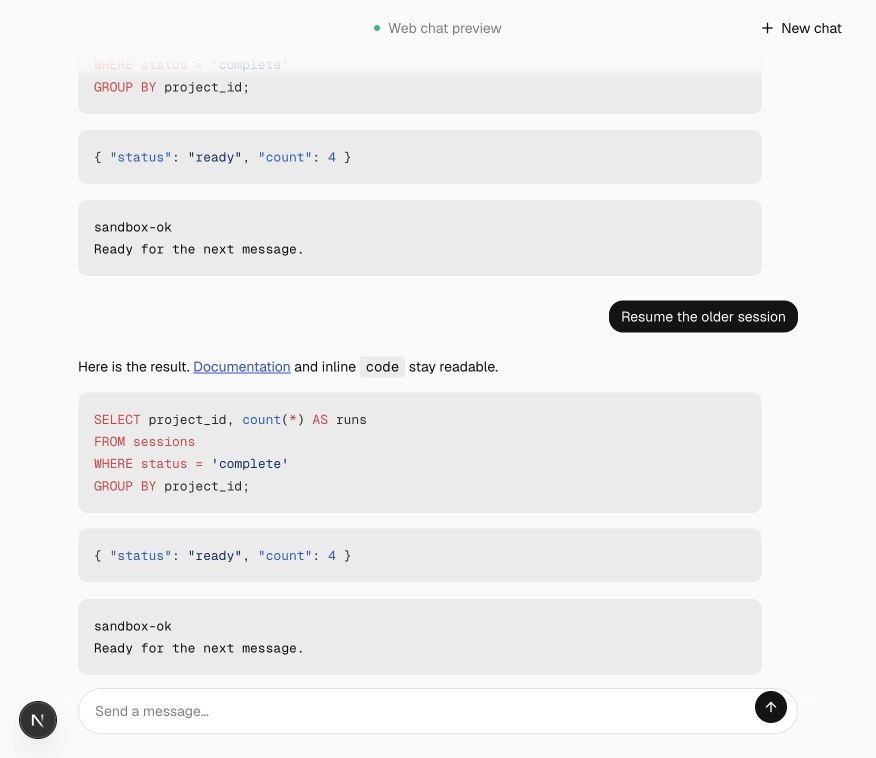
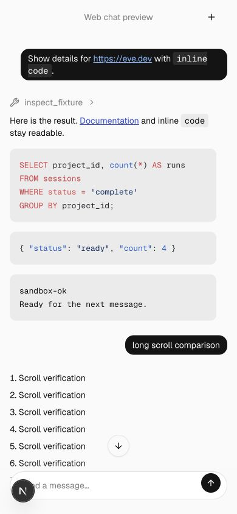

# Live conversation state

Opening an existing conversation positions it at the latest message. Sending follows the new turn; repeated user messages keep their identities. Parent controls derive activity from parent turn boundaries. Reachability disables the composer with Server unreachable and recovers when the server returns.

## Comparison

| Viewport                  | Before                                | After                               |
| ------------------------- | ------------------------------------- | ----------------------------------- |
| Desktop, 876 × 758 CSS px |  |  |
| Mobile, 390 × 844 CSS px  |    |    |

Compared opening the same long conversation before and after. Paused and resumed the owned fixture backend; the composer disabled with Server unreachable and recovered. Additional captures record both states. Repeated-message and parent-turn boundaries are covered by source tests.

## Validation

Generated template parity, 65 scaffold integration tests, lint and focused formatting passed. The cumulative web suite passed 13 tests and its TypeScript check.

See the [reproduction notes](../README.md) for the deterministic fixture and common prerequisites. These are review captures, not visual-design approval.

[Disconnected](offline-desktop.png) · [Recovered](recovered-desktop.png)
