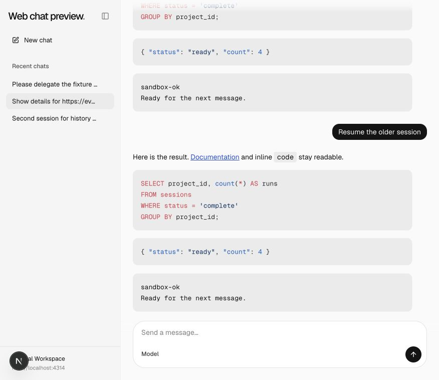
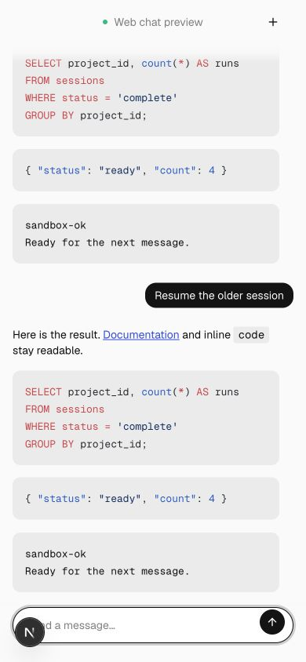
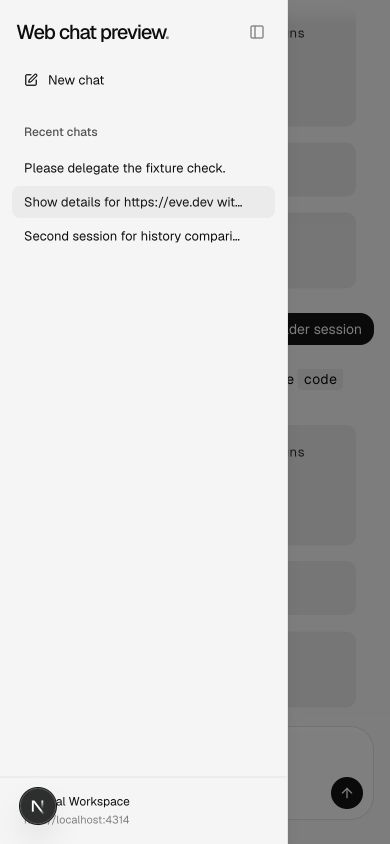

# Session history and navigation

A persistent, resizable sidebar lists chats by last message, exposes creation and last-turn metadata, and preloads selected histories before navigation. The mobile drawer remains reachable. Cached switches retain the workspace instead of flashing a conversation loading screen.

## Comparison

| Viewport                  | Before                                | After                               |
| ------------------------- | ------------------------------------- | ----------------------------------- |
| Desktop, 876 × 758 CSS px |  |  |
| Mobile, 390 × 844 CSS px  |    |    |

Created a second chat, resumed the older chat and observed activity ordering; switched cached sessions and opened the mobile sidebar. The screenshots show the same fixture history. Tooltip timing and navigation animation are not demonstrated by still images.

## Validation

Generated template parity, 65 scaffold integration tests, lint and focused formatting passed. The cumulative web suite passed 27 tests and its TypeScript check.

See the [reproduction notes](../README.md) for the deterministic fixture and common prerequisites. These are review captures, not visual-design approval.
