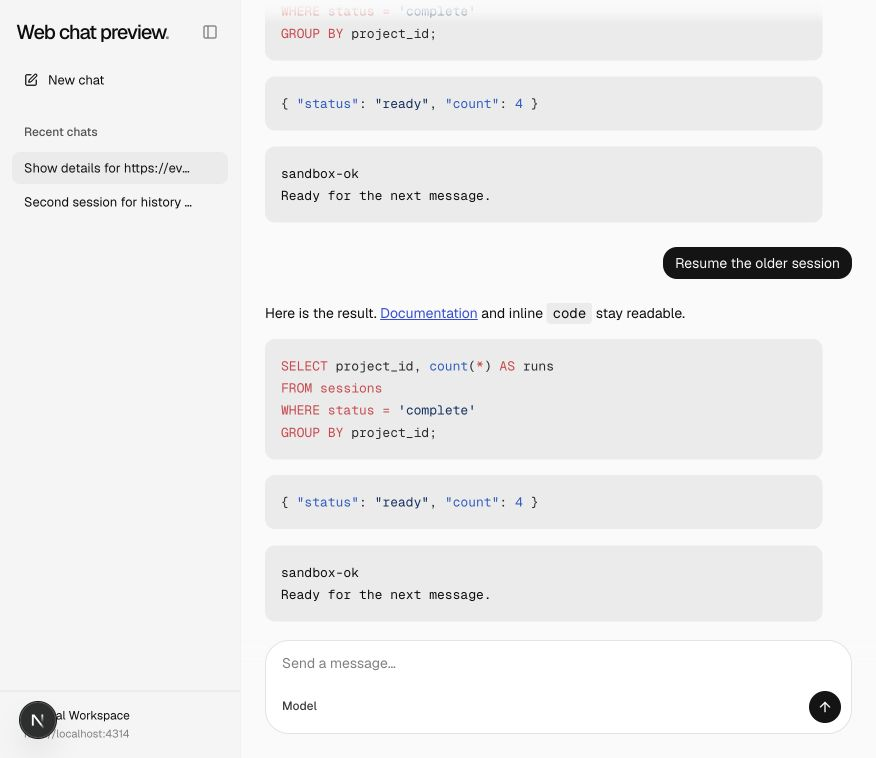
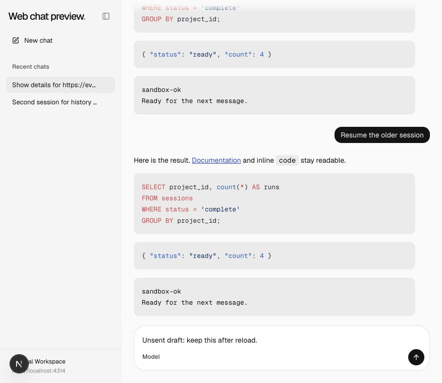
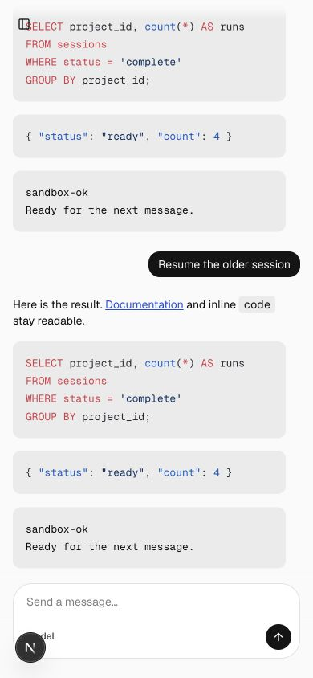

# Persistent composer drafts

Draft text, selection and undo history survive reload and are scoped by viewer, session and browser tab. Attachments use IndexedDB. Acknowledgment clears only the submitted revision, so edits made while sending remain intact.

## Comparison

| Viewport                  | Before                                | After                               |
| ------------------------- | ------------------------------------- | ----------------------------------- |
| Desktop, 876 × 758 CSS px |  |  |
| Mobile, 390 × 844 CSS px  |    |    |

Typed Unsent draft: keep this after reload. Before loses the draft; after restores it. Verified undo after reload in the browser. Attachment recovery, late acknowledgment and multi-tab isolation have source coverage, not individual screenshot coverage.

## Validation

Generated template parity, 65 scaffold integration tests, lint and focused formatting passed. The cumulative web suite passed 36 tests and its TypeScript check. Framework invariant checks passed after removing unsafe casts and conditional object spreads.

See the [reproduction notes](../README.md) for the deterministic fixture and common prerequisites. These are review captures, not visual-design approval.
