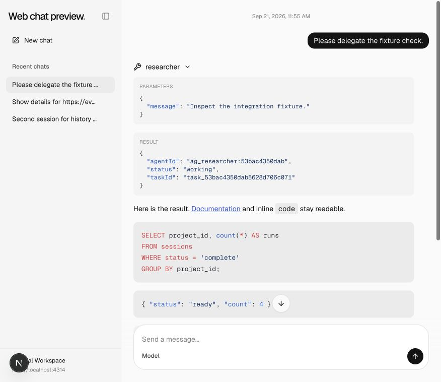
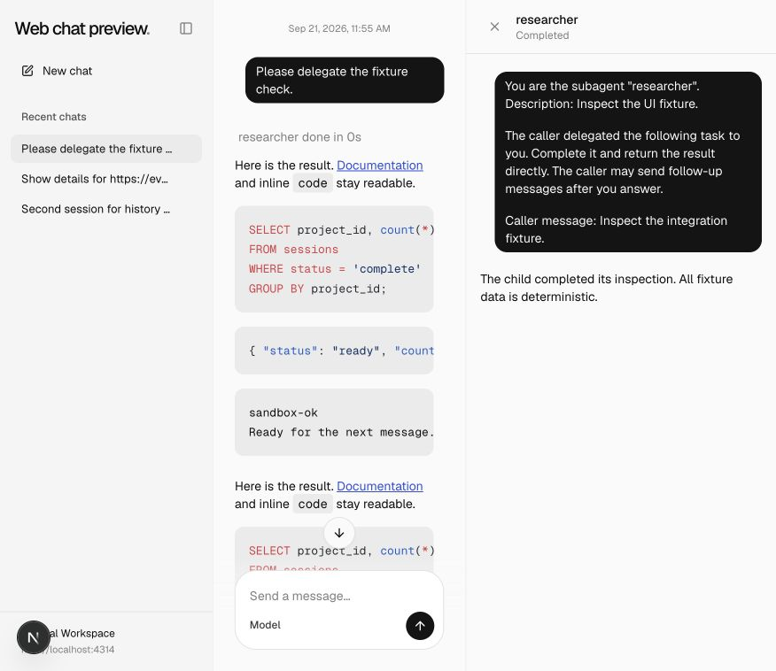
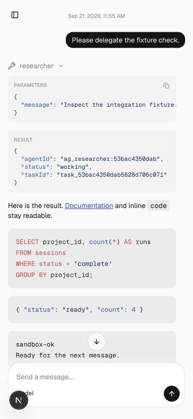
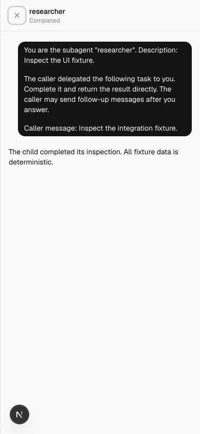

# Subagent inspection

Clicking a named subagent opens a closable, resizable detail pane, or a mobile sheet. A workspace-owned stream cache and saved checkpoints retain transcript, reading position and disclosure state. Completed children show their terminal state and elapsed time instead of replaying as Working.

## Comparison

| Viewport                  | Before                                | After                               |
| ------------------------- | ------------------------------------- | ----------------------------------- |
| Desktop, 876 × 758 CSS px |  |  |
| Mobile, 390 × 844 CSS px  |    |    |

Opened the completed researcher, closed and reopened the pane, then reloaded. The completed transcript remained available without reverting to Connecting. Captures show the generic tool result before and the completed child pane after. Cursor and connection ownership are covered by source tests; network request counts were not instrumented in the browser.

## Validation

Generated template parity, 65 scaffold integration tests, lint and focused formatting passed. The cumulative web suite passed 63 tests and its TypeScript check. Framework invariant checks passed after removing unsafe casts and conditional object spreads.

See the [reproduction notes](../README.md) for the deterministic fixture and common prerequisites. These are review captures, not visual-design approval.
