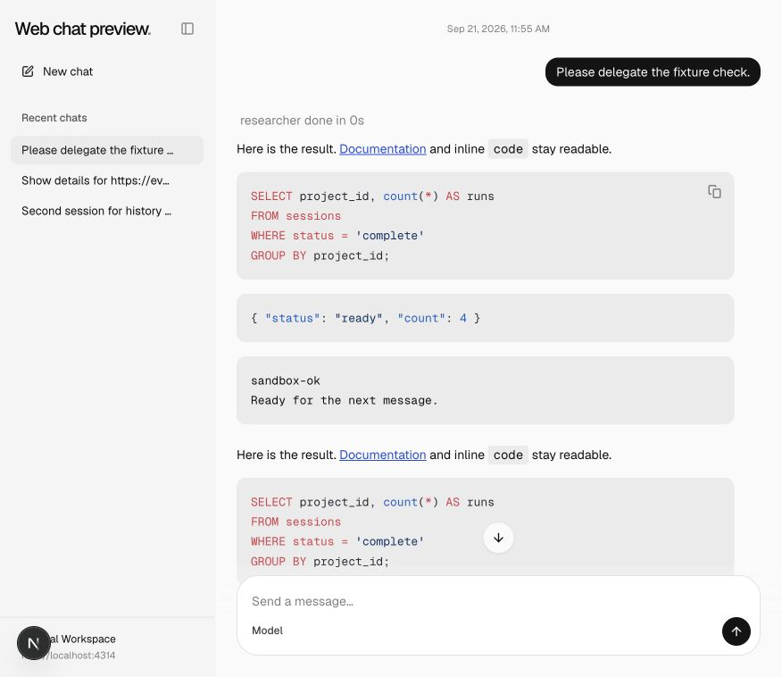
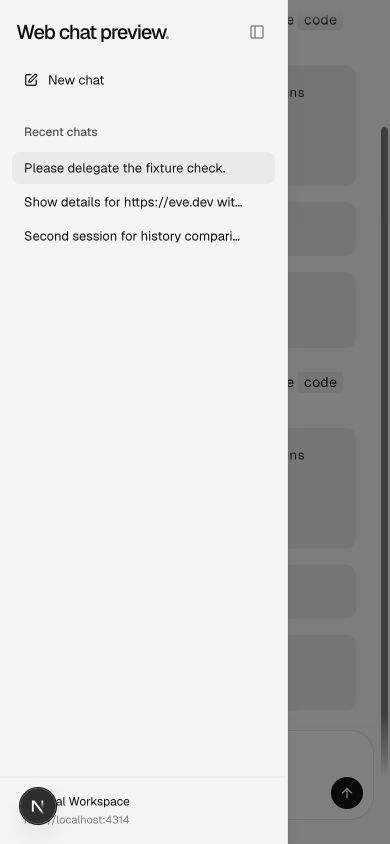
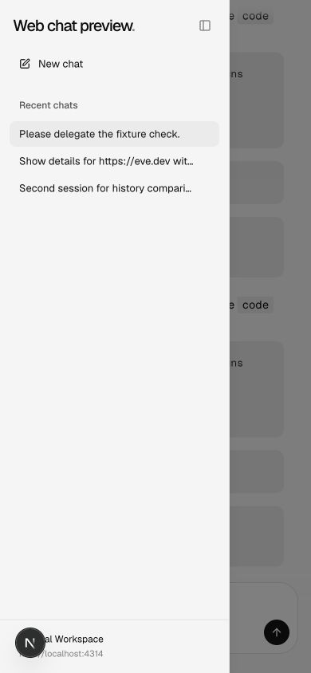

# Production session ownership

Local development retains filesystem session history. Production uses verified Vercel identity and a scoped SQL metadata index; resource access checks cover session reads, controls and child stream bindings. eve remains the transcript store.

## Comparison

| Viewport                  | Before                                | After                               |
| ------------------------- | ------------------------------------- | ----------------------------------- |
| Desktop, 876 × 758 CSS px |  |  |
| Mobile, 390 × 844 CSS px  |    |    |

Before and after captures show local mode preserving the same history. Production ownership is validated separately by SQL tests with two owner keys, guarded route tests and a real Better Auth rejection probe. These screenshots do not establish a deployed two-user OAuth flow.

## Validation

Generated template parity, 65 scaffold integration tests, lint and focused formatting passed. The cumulative web suite passed 74 tests and its TypeScript check. Framework invariant checks passed after removing unsafe casts and conditional object spreads. The full workspace typecheck passed 51 tasks with build concurrency set to one; docs checks passed. The auth probe rejected forged cookies and client-written provider identity.

See the [reproduction notes](../README.md) for the deterministic fixture and common prerequisites. These are review captures, not visual-design approval.
