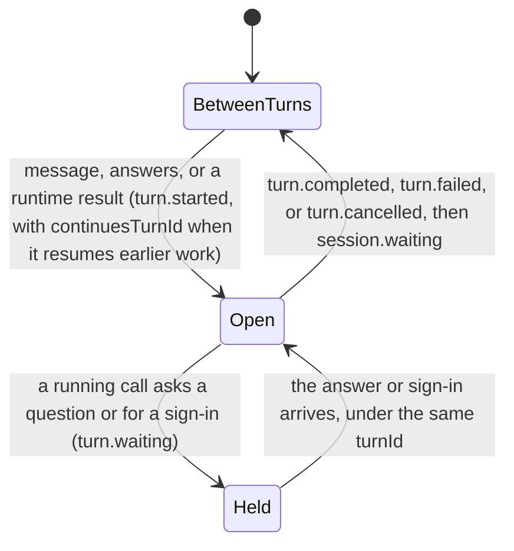
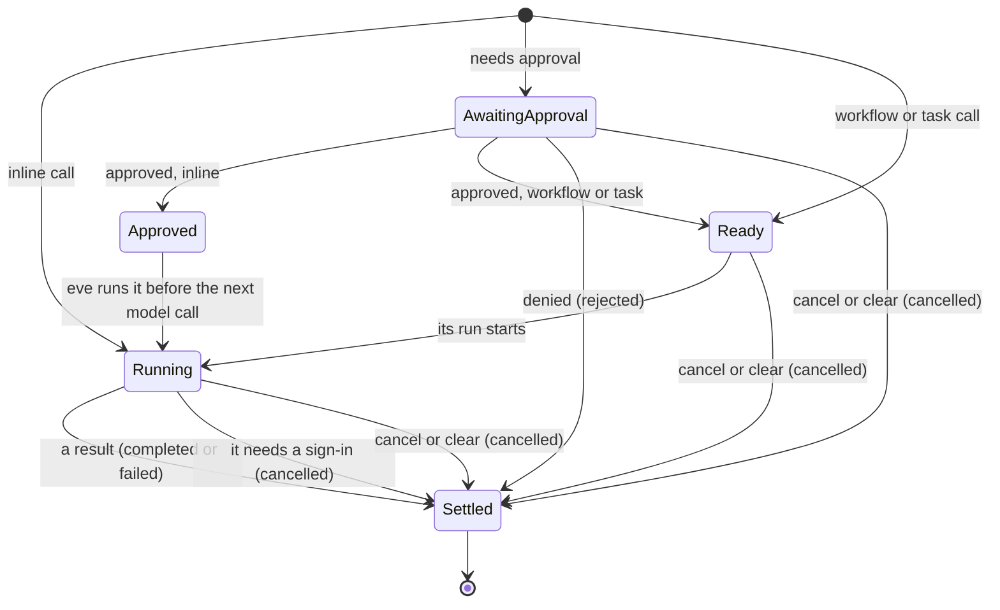
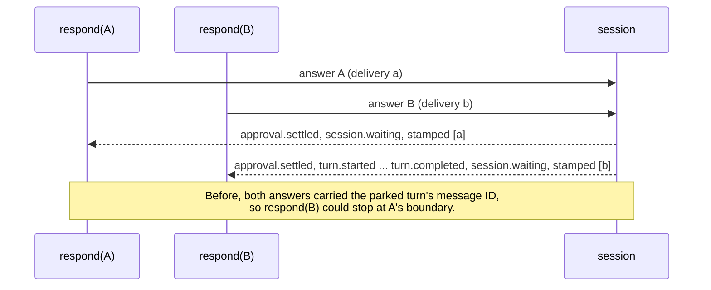
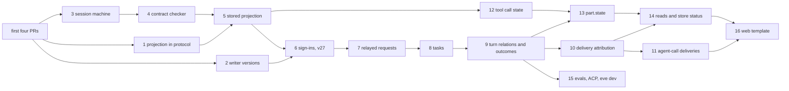

# One source of truth for session state

## Summary

eve works out where a session stands in many places. On the server, pending work lives in ten
durable records. The code that changes a record also has to emit the matching stream event. On
the client and in eve's own readers, several folds read the same events with their own rules.
Many of the lifecycle bugs found while preparing this plan were two of these copies disagreeing.

This plan gives each piece of session state exactly one owner:

- **A session machine** is the only code that changes pending work or builds lifecycle events.
- **A session projection** is folded from the events the machine publishes, and it answers every
  lifecycle question on the server and the client.
- **Private records** hold what the stream never shows. Each is keyed by an ID the projection
  tracks and is dropped when its owner closes.
- **Caches** are written in one place.

The stream states the facts readers used to guess. Clients, Slack task cards, evals, and ACP read
the projection instead of folding events themselves. The work lands as the 16 PRs listed under
[Implementation plan](#implementation-plan).

## Starting point

This plan assumes these four PRs have merged:

| PR    | What it establishes                                                                                                                                                                                    |
| ----- | ------------------------------------------------------------------------------------------------------------------------------------------------------------------------------------------------------ |
| #3878 | Stable part IDs for text and reasoning; authorization parts matched by `attemptId`; replayed tool events no longer reopen settled approvals                                                            |
| #3879 | One conversation client: hooks and `EveAgentStore` return `ConversationState` (messages plus turns, inputs, tasks, and agent sessions), with canonical `conversation` beside a custom reducer's `data` |
| #3880 | `eve dev` runs on `EveAgentStore`                                                                                                                                                                      |
| #3965 | A task call's tool part keeps running until `task.settled`                                                                                                                                             |

After them, the client folds lifecycle once, in `ConversationState`. The server is unchanged: it
keeps the records below and publishes stream version 26.

## Problem

### Many copies of the same state

```text
            server records, each written and cleared on its own
            ┌──────────────────────────────────────────────────┐
 harness ──▶│ pending input batches   coordination batch       │
 steps      │ deferred step input     workflow tool runs       │
            │ approval grants         emission state           │
            │ relayed requests        pending sign-ins         │
            │ approval candidates     task table               │
            └──────────────────────────────────────────────────┘
                 │  events built separately, in 16 files
                 ▼
               stream ──▶ ConversationState fold   message reducer's part.state
                     ──▶ ClientSession TurnSegment  EveAgentStore helpers
                     ──▶ Slack task-card fold       eval run facts   ACP adapter
```

| Question                                     | Where eve answers it                                                                                                                                                                                                                                     |
| -------------------------------------------- | -------------------------------------------------------------------------------------------------------------------------------------------------------------------------------------------------------------------------------------------------------- |
| Is a turn open? Is the session idle?         | emission state, the cached `DurableSessionState.turn`, `isSessionStateIdleForHandoff`, `ConversationState.activeTurnId`, `TurnSegment`, `EveAgentStore` status, `derive-run-facts`, the ACP adapter                                                      |
| What is pending?                             | pending input batches, the coordination batch, deferred step input, workflow tool runs, relayed requests and the cached `hasProxyInputRequests`, pending sign-ins, approval candidates, the task table, client inputs, message parts, task-card blockers |
| Where does a call stand?                     | the pending batches and run registry, the task table, `part.state`, client task calls, Slack task cards, `derive-run-facts`, the ACP adapter                                                                                                             |
| Which turn or call does something belong to? | emission state, `TurnDeliveryIdsKey` (messages only), the client's settlement buffering, `agentCallTurns`                                                                                                                                                |

### Why they drift

1. **Changing a record and emitting its event are separate statements.** Lifecycle events are
   built in 16 files. Every site that changes a record must also emit, and some don't.
2. **Records keep copies of public facts.** Relayed requests store each request's coordinates,
   kind, and question. The task table stores calls and outcomes. Approval candidates store
   settlements. Each copy is parsed, validated, and closed by hand: relayed requests at five
   sites, and sign-ins at two, plus supersession.
3. **A record tracks whether its events went out.** Approval candidates carry `eventEmitted` and
   `pendingEventEmitted` flags. The tool loop emits every unmarked entry, then marks it.
4. **Readers re-derive from raw events.** The message reducer folds a second call lifecycle into
   `part.state`. `agentCallTurns` assigns a child session's turns to calls by counting messages.
   The task-card fold maps a denied call to `failed`.
5. **Status is inferred from shape.** The handoff idle check probes five raw keys and three
   registries. Nothing writes one of those keys, `eve.harness.pendingWorkflowInterrupt`.

These cause user-visible bugs:

- `clear` leaves approvals answerable, so a later answer runs a call from the cleared context.
- A workflow call can dispatch while its approval is open. #3983 added a filter for this.
- Approvals are replayed through the AI SDK, so new input waits behind an approval batch.
- Answering some of a step's approvals emits no boundary, so `respond()` waits for the rest.
- Cancelling a turn clears relayed requests without an event, and so does a task run that
  finishes on its own. Readers keep showing those requests as answerable.
- A relayed request carries the child session's coordinates, so clients attach it to the root's
  first message.
- An answer's events carry the delivery IDs of the message that started the parked turn, so
  `respond(B)` can stop at a sibling answer's boundary.

## Design

### Four kinds of state

Every durable piece of session state is exactly one of these:

| Kind           | What                                                                                                                                              | Written by                                 |
| -------------- | ------------------------------------------------------------------------------------------------------------------------------------------------- | ------------------------------------------ |
| Machine state  | `TurnState`: the open turn and its deliveries, parked steps and their calls, the prompt, queued input, task results the model hasn't read, grants | The session machine only                   |
| Projection     | `SessionProjection`: turns, inputs, tasks, calls, sign-ins                                                                                        | Folding the events the machine publishes   |
| Private record | What readers never see, keyed by an ID the projection tracks: relay routes, sign-in attempts, task runs, approval candidates                      | The machine; dropped when its owner closes |
| Cache          | A derived value for a reader that can't load the session, such as `hasProxyInputRequests`                                                         | The save function                          |

A record with its own status, or a flag recording whether an event went out, is none of these.

```text
                     ┌────────────── session machine ─────────────┐
 message, answers, ─▶│ transition(view, input) → { turn, events } │
 results, cancel ... └───────┬───────────────────────────┬──────────┘
                             ▼                           ▼
                 TurnState + private records      events ──▶ stream ──▶ client fold
                                                     │                 (same code)
                                                     ▼
                                          stored SessionProjection ──▶ task cards,
                                                                       idle check, caches
```

### Invariants

1. Only the session machine writes `TurnState` and builds lifecycle events. Callers publish what
   a transition returns.
2. The stored projection is the fold of every event the session publishes, its own and relayed
   ones. It is saved with the step that published them.
3. A private record exists only while the projection shows its owner open. Closing the owner
   means emitting its event, and the record is dropped with it.
4. Every lifecycle question is answered by the projection. `TurnState` answers only what the
   stream doesn't carry, such as which calls wait to dispatch.
5. Caches are computed in the save function.

`pnpm guard:invariants` enforces invariants 1 and 2. The check fails if code outside the machine
imports turn-state writers or lifecycle event constructors, or if code outside the commit path
writes the stored projection:

```js
// scripts/guard-invariants.mjs (sketch)
forbidImports({
  from: ["#harness/session-machine/state.js", "#harness/session-machine/events.js"],
  outside: "packages/eve/src/harness/session-machine/",
});
```

### The session machine

The machine is one directory. Its transition list reads as the lifecycle:

```text
harness/session-machine/
  state.ts        TurnState and its codec (private to the directory)
  events.ts       lifecycle event builders (private to the directory)
  view.ts         SessionView: turn state, stored projection, private records
  transitions.ts  every lifecycle transition
  commit.ts       publish, fold, prune, save: the only way state changes
protocol/session-projection.ts   the fold, shared with clients
```

```ts
// harness/session-machine/transitions.ts (sketch)
export const transitions = {
  receive, // a message or answers arrive: open a turn, or join the open one
  decide, // approval decisions: approve, deny, or grant once()
  parkStep, // a model response with calls that can't all settle now
  dispatch, // ready workflow and task calls start their runs
  settle, // a call's result; commit the step once every call has one
  requireSignIn, // a call needs a sign-in: settle it cancelled, ask for the sign-in
  completeSignIn, // a sign-in callback: complete it before the turn it resumes
  relay, // a child's question or sign-in, passed up under the served call
  routeAnswer, // an answer to a relayed request: forward it, resolve it here
  finishRun, // a task or workflow run ends: settle its calls, withdraw its requests
  finishTurn, // nothing left to run: close the turn, or hold it for running calls
  cancel, // the turn is cancelled: settle, withdraw, close
  clear, // the context is cleared: settle, withdraw everything, empty history
} satisfies Record<string, (view: SessionView, input: never) => Transition>;
```

```ts
interface SessionView {
  readonly turn: TurnState;
  readonly projection: SessionProjection;
  readonly records: PrivateRecords;
}

/** What every transition returns. Nothing else changes session state. */
interface Transition {
  readonly turn: TurnState;
  readonly records?: Partial<PrivateRecords>; // new private data, such as a relay route
  readonly events: readonly LifecycleEvent[];
}
```

Durable steps share one shape. A step loads the view, runs its effects, returns a transition,
and `commit` does the rest:

```ts
// harness/session-machine/commit.ts (sketch)
export async function commit(view: SessionView, t: Transition, publish: Publish) {
  for (const event of t.events) await publish(event); // stream, channel, hooks, instrumentation
  const projection = prune(t.events.reduce(foldSession, view.projection));
  return {
    turn: t.turn,
    projection,
    records: dropClosed({ ...view.records, ...t.records }, projection),
  };
}
```

Cancelling a task shows the difference. Today (from `execution/tasks/steps.ts`, trimmed):

```ts
let table = readTaskTable(session.state);
for (const taskId of input.taskIds) {
  const cancelled = cancelTask(table, taskId);
  table = cancelled.table;
  events.push(...taskSettledEvents(record, cancelled.settled, CANCELLED));
  if (cancelled.send !== undefined) await sendTaskRunCommands(cancelled.send);
}
const withdrawn = withdrawWorkflowAsks(session, (_id, runId) => stoppedRunIds.has(runId));
const relayed = await relaySessionEvents(
  { ...input, sessionState: saveTable(input.sessionState, withdrawn.session, table) },
  withdrawn.events,
);
return await publishSessionEvents({ ...input, ...relayed }, events);

// A run that finishes on its own takes a second path, which emits nothing:
function forgetRunQuestions(session: DurableSession, runId: string): DurableSession {
  return clearProxyInputRequestsWhere(session, (route) => route.workflowAsk?.runId === runId);
}
```

With the machine:

```ts
export async function cancelTasksStep(input: SessionStep & { taskIds: readonly string[] }) {
  "use step";
  return await step(input, async (view) => {
    await stopRuns(view.records.runs, input.taskIds); // effect
    return finishRun(view, { taskIds: input.taskIds, outcome: "cancelled" }); // decision
  });
}

// transitions.ts: one path for a cancel and for a run that ends on its own
function finishRun(view: SessionView, run: { taskIds: readonly string[]; outcome: TaskOutcome }) {
  return {
    turn: view.turn,
    events: [
      ...openInputs(view.projection, run).map(withdrawn), // input.resolved "cancelled"
      ...openTaskCalls(view.projection, run).map((call) => taskSettled(call, run.outcome)),
    ],
  };
}
```

Relay routes and task runs are never cleared by hand. `commit` drops them once the projection
shows their request or task closed.

### Turn and call lifecycles

A turn:



A call. The machine tracks each parked call through these states, and the projection reports
the status readers see:



| Machine state                 | Projection status                                                      |
| ----------------------------- | ---------------------------------------------------------------------- |
| awaiting approval             | `awaiting-input`                                                       |
| approved, ready, running      | `running`                                                              |
| settled                       | the result's status: `completed`, `failed`, `rejected`, or `cancelled` |
| no result when its turn ended | `interrupted`                                                          |

The turn's phase is derived, never stored. If a ready or running workflow or task call exists,
the turn waits on the runtime. If only approvals or the prompt remain, the turn closes. Otherwise
the model runs.

### What the records become

| Record                                                 | Public part, read from the projection                 | Private part that remains                                                                                | Plan PR |
| ------------------------------------------------------ | ----------------------------------------------------- | -------------------------------------------------------------------------------------------------------- | ------- |
| The six pending-work records                           | pending approvals, calls, and turns                   | `TurnState`                                                                                              | 3       |
| Approval candidates (`eve.runtime.hitl.approvalState`) | settlements                                           | responder progress (candidate, expiry, sign-in challenges), owned by its request                         | 3       |
| `TurnDeliveryIdsKey`                                   | none                                                  | `TurnState.turn.deliveryIds`                                                                             | 3       |
| `eve.harness.pendingWorkflowInterrupt`                 | none                                                  | none; deleted                                                                                            | 3       |
| Pending sign-ins (`eve.runtime.pendingAuthorization`)  | open or closed, name, `callIds`, coordinates          | attempt by `attemptId`: callback URL, resume value, principal, connection instance                       | 6       |
| Relayed requests (`eve.runtime.proxyInputRequests`)    | open or closed, kind, coordinates, question, `callId` | route by `requestId`: continuation token, inbox, remote binding, workflow-ask route                      | 7       |
| Task table (`eve.taskTable`)                           | name, kind, calls and outcomes                        | run by `taskId`: hook token, run ID, held commands, usage, `resumable`; unread results go to `TurnState` | 8       |
| Slack task cards (`channel.state`)                     | calls, statuses, blockers                             | presentation: titles, bounded inputs, summaries, times                                                   | 5       |

Derived questions become one-liners:

```ts
export const isIdle = (v: SessionView) => v.turn.queued === undefined && !hasOpenWork(v.projection);

export const hasProxyInputRequests = (v: SessionView) =>
  openInputs(v.projection).some((input) => v.records.routes[input.requestId] !== undefined);
```

The projection is folded on every event, not only for a particular reader, and includes relayed
events. Before it's stored in every session, its pruning must be bounded. A fold that keeps every
turn that continues another would grow without limit in a long-lived session. It keeps one link
from each open turn to its root instead.

### What the stream states

Each fact the session knew but the stream left unstated becomes a field or value. The stream
version moves to 27 with the first PR that changes a meaning.

| Fact                                        | Readers guessed                                                      | Now                                                                                      | PR  |
| ------------------------------------------- | -------------------------------------------------------------------- | ---------------------------------------------------------------------------------------- | --- |
| Withdrawals                                 | a cancelled turn or a finished run dropped relayed requests silently | `input.resolved` `cancelled`, `authorization.completed` `failed`, before the owner ends  | 3   |
| Which calls a sign-in stops                 | every unsettled call in a closed turn with an open sign-in           | `authorization.required.callIds`; each settles `cancelled` with `AUTHORIZATION_REQUIRED` | 6   |
| Which attempt a completion closes           | `attemptId`, else the approval candidate, else the latest attempt    | `attemptId` required on both events                                                      | 6   |
| When a sign-in callback completes           | the completion could follow the resumed turn's start                 | it precedes that turn, at the asking turn's coordinates                                  | 6   |
| Which call a relayed request serves         | the parent adopted the child's call and guessed its status           | relayed `input.requested.callId`, with the served call's coordinates and `taskId`        | 7   |
| Which turn a turn continues                 | settlements buffered between turns                                   | `turn.started.continuesTurnId`                                                           | 9   |
| Which turn runs an approved call            | the open turn, or else the next                                      | `input.resolved` resolutions carry `resumeTurnId`                                        | 9   |
| Calls eve stops                             | no result; readers inferred from the turn's status                   | `action.result` status `cancelled`, with `TURN_CANCELLED` or `CONTEXT_CLEARED`           | 9   |
| Policy denials                              | `failed` with `TOOL_EXECUTION_DENIED`                                | `rejected`                                                                               | 9   |
| Approval policy events' coordinates         | they named the turn about to start                                   | they name the step that asked                                                            | 9   |
| Which delivery an answer's events belong to | the IDs of the message that started the parked turn                  | the answer's own delivery ID                                                             | 10  |
| Which parent call a child's turn serves     | counting the child's user messages                                   | `task.started.deliveryId` for agent calls; the child stamps it                           | 11  |
| Which code wrote an event                   | the serving deployment's `x-eve-stream-version` header               | `meta.streamVersion` on every event                                                      | 2   |

With delivery attribution, overlapping answers each reach their own boundary:



### Clients and eve's other readers

`ConversationState` embeds `SessionProjection`, and everything else is a selector over it.

**Tool call state.** Status comes from the projection, and content from the canonical part:

```ts
export function toolCallState(
  conversation: ConversationState,
  callId: string,
  { streaming = true } = {},
): ToolCallState {
  const status = callStatus(conversation, callId, { streaming });
  const part = findToolPart(conversation.messages, callId);
  return { status, output: part?.output, errorText: part?.errorText };
}
```

The store always keeps canonical `conversation` beside a custom reducer's `data`, so this works
with any reducer.

**`part.state`.** The message reducer keeps content (text, reasoning, tool input, and output) and
writes `part.state` from the projection:

| Projection status                                    | `part.state`                                                  |
| ---------------------------------------------------- | ------------------------------------------------------------- |
| `running`                                            | `input-available`, or `output-available` with `partial: true` |
| `awaiting-input`                                     | `approval-requested`                                          |
| `completed`                                          | `output-available`                                            |
| `failed`, `cancelled`, or `interrupted` (turn ended) | `output-error`, with `errorText` saying why                   |
| `rejected`                                           | `output-denied`                                               |

`output-error` also covers calls eve stopped, and `toolCallState` tells stopped calls from failed
ones. A call interrupted because the reader's stream stopped remains a read-time judgment, passed
as `streaming`.

**Reads and store status.** `respond()` and `send()` resolve when their delivery reaches a
boundary stamped with its ID. `EveAgentStore` status is a check over the same facts. Only sends
not yet accepted, HTTP errors, and aborts stay local:

```ts
function storeStatus(conversation: ConversationState, sends: LocalSends): EveAgentStoreStatus {
  if (sends.error !== undefined) return "error";
  if (sends.resuming) return "resuming";
  if (sends.unaccepted > 0) return "submitted";
  return sends.accepted.some((id) => !reachedBoundary(conversation, id)) ? "streaming" : "ready";
}
```

**Agent calls.** A call's child turns are the turns stamped with the delivery it sent. Today
(from `client/conversation-state.ts`, trimmed):

```ts
// The k-th message the session received came from the task's k-th call; a turn without
// a message of its own continues the previous call.
for (const message of conversation.messages) {
  if (message.role !== "user") continue;
  const callId = callIds[index++];
  ...
}
```

With PR 11:

```ts
const callTurns = (child: ConversationState, deliveryId: string) =>
  Object.values(child.turns).filter((turn) => turn.deliveryIds.includes(deliveryId));
```

**eve's other readers.** Slack task cards, `derive-run-facts`, eval assertions, the ACP adapter,
and the `eve dev` runner read the projection. ACP stops reporting rejected and cancelled calls as
failed, and task cards stop reporting denied calls as failed.

## Compatibility

Sessions aren't ported to the new state. This follows existing practice:

- The session checkpoint version went from 4 to 10 between #3263 and #3970. #3970's changeset
  tells users to keep each session's owning deployment available until the session finishes.
- An incompatible handoff leaves the session on its current owner (#4032).
- On Vercel, old sessions keep running old code. Sessions park after each turn instead of
  ending (#3817), so an old deployment may serve a thread indefinitely.
- Local and in-place upgrades have no old code to keep. The next delivery fails with
  `Unsupported session checkpoint. Start a new session on this deployment.`

Each PR that changes durable state bumps `SESSION_CHECKPOINT_VERSION`: PRs 3, 5, 6, 7, and 8.

Streams need one addition. `x-eve-stream-version` reports the serving deployment's version, but
the events come from shared storage, and an older owner may have written them. Reading by that
header would misread old sessions: a `respond()` that filters by its answer's delivery ID would
wait forever on events a v26 owner wrote. PR 2 stamps each event's `meta.streamVersion`.
Everything that depends on the version keys off the event instead of the header, including the
`respond()` filter and the projection's guesses for older writers. Those guesses stay until eve
sets a floor for the writer versions it reads.

Clients from before v27 reject v27 streams with an unsupported-version error. The v27 stream
changes ship in one release. If they span releases, each release that changes a meaning bumps the
version.

## Testing

- **Transitions are pure,** so most lifecycle tests are unit tests that call a transition and
  check the state and events it returns.
- **A stream contract checker** (`internal/testing/session-contract.ts`) is a test oracle and
  doesn't ship in eve. It checks each event against the stream before it, and the session's state
  after each step. The tool-loop fixture and the tests that read a session's workflow stream run
  it.
- **Generated sessions** run seeded random sequences of messages, answers, steering, results,
  sign-ins, cancels, and clears against a model that calls tools at random. CI runs a fixed seed
  set.
- **Each rule lands with the PR that makes it hold:**

  | Rule                | A reader may rely on                                                        | PR  |
  | ------------------- | --------------------------------------------------------------------------- | --- |
  | `turn-order`        | one turn at a time, content inside its turn, nothing after the session ends | 4   |
  | `resolved-twice`    | a request resolves once                                                     | 4   |
  | `open-after-owner`  | no request or sign-in outlives its task, turn, a clear, or the session      | 4   |
  | `state-agreement`   | the projection shows exactly what the session awaits                        | 4   |
  | `unasked-sign-in`   | a call settled for a sign-in is named by an `authorization.required`        | 6   |
  | `own-coordinates`   | events name only turns and calls this stream announced                      | 7   |
  | `unsettled-call`    | a completed turn leaves no call without an outcome                          | 9   |
  | `delivery-boundary` | every accepted delivery reaches a boundary stamped with its ID              | 10  |

- **End-to-end evals** cover approvals (partial, separate, stale, and policy-settled answers),
  sign-ins, relayed questions, task and workflow calls, cancellation, and `respond()` with
  overlapping answers. TUI smoke tests cover `eve dev`.

Drafts of most of these changes exist in #4018, #4044, #3986, and #3977. Against them, 1,500
generated seeds pass locally. On 200 seeds, removing the cancel withdrawals fails 15% of seeds,
removing the clear withdrawals fails 40%, and removing the sign-in ask beside an approval fails
55%.

## Implementation plan

Every PR builds, passes CI, and carries its own tests, docs, and changeset. PRs 1–3 don't depend
on one another; the rest land in order.



Sizes are rough net estimates for production code in `packages/eve/src`.

| #   | PR                                | Kind                          | Est. net     |
| --- | --------------------------------- | ----------------------------- | ------------ |
| 1   | Session projection in `protocol/` | move                          | ~0           |
| 2   | Writer versions                   | stream, additive              | +40          |
| 3   | Session machine                   | server refactor and behavior  | −700 to −800 |
| 4   | Contract checker                  | tests                         | 0            |
| 5   | Stored projection                 | server                        | 0 to +100    |
| 6   | Sign-ins                          | stream (v27), derived record  | −50 to 0     |
| 7   | Relayed requests                  | stream, derived record        | −150 to −230 |
| 8   | Tasks                             | derived record                | −150 to −250 |
| 9   | Turn relations and outcomes       | stream                        | +50 to +100  |
| 10  | Delivery attribution              | stream, client                | +80 to +120  |
| 11  | Agent-call deliveries             | stream, remote-agent protocol | +40 to +80   |
| 12  | Tool call state                   | client API                    | +80 to +120  |
| 13  | `part.state` from the projection  | client behavior               | −100 to −150 |
| 14  | Reads and store status            | client                        | −150 to −300 |
| 15  | Evals, ACP, and `eve dev`         | readers                       | −80 to −150  |
| 16  | Web template                      | template                      | template     |

In total, production code in `packages/eve/src` should shrink by roughly 750–1,650 lines. Tests
should shrink by about 3,000, mostly suites written against the replaced records. These are
estimates, not measurements. PR 7 is the best calibration point: after the session machine, it
is the largest deletion, and it exercises the whole derived-record pattern.

### 1. Session projection in `protocol/`

- Moves the conversation reducer's turn, input, and task fold into
  `protocol/session-projection.ts`, unchanged in meaning.
- `ConversationState` embeds it. No behavior changes.

### 2. Writer versions

- Stamps `meta.streamVersion` on every event. Readers treat its absence as 26 or older.
- Client version checks read the event's version instead of the header.

### 3. Session machine

- `TurnState` replaces the six pending-work records. The machine is the only writer of turn state
  and the only builder of lifecycle events, and `commit` is the only way state changes.
- `TurnDeliveryIdsKey` moves into `TurnState.turn`. Approval candidates' transitions move into the
  machine, and their emitted flags go.
- Adds `isIdle` and the guards, and deletes the interrupt key.
- Cancel, clear, and a run ending report every withdrawal.
- eve runs approved calls itself, before the model reads their results, and `ctx.messages` is the
  model's history. `clear` withdraws approvals, the prompt, and sign-ins. A partial answer returns
  the session to waiting. Workflow calls dispatch only once ready.
- Regression tests hold three cases: a policy pass that settles nothing doesn't start a turn, an
  approval's first decision stands, and a declined session-limit prompt resolves once.
- Ports the #3983 approved-workflow scenarios, the approval-resume suite, and the #3494
  adversarial suite.

### 4. Contract checker

- Test only: the checker, its runs in the tool-loop fixture and in tests that read a session's
  workflow stream, and generated sessions.
- Adds the rules that hold after PR 3: `turn-order`, `resolved-twice`, `open-after-owner`, and
  `state-agreement`.

### 5. Stored projection

- Folds every published event, own and relayed, into the stored projection, with bounded pruning.
- Adds calls and sign-ins to the projection.
- The handoff idle check and Slack task cards read it, and the task-card fold goes. Task cards
  keep their presentation details in channel state.

### 6. Sign-ins

- `authorization.required.callIds`, and `attemptId` required on both sign-in events.
- A call stopped for a sign-in settles `cancelled` with `AUTHORIZATION_REQUIRED`. This moves the
  stream to v27.
- A callback's completion precedes the turn it resumes.
- Pending sign-ins become projection plus private attempts, and supersession emits `failed`.
- Regression tests hold three cases: a call that needs a sign-in beside an approval asks for it, a
  sign-in doesn't close a turn while runs work, and an approved call that needs a sign-in leaves
  its step.
- Adds the `unasked-sign-in` rule.

### 7. Relayed requests

- A relayed `input.requested` names the served call in `callId` and uses its coordinates and
  `taskId`. The parent stops recording the child's call.
- Relayed requests become projection plus private routes, and `hasProxyInputRequests` is derived.
- `turn.waiting` follows a relayed request only while the parent has an open turn.
- Adds the `own-coordinates` rule.

### 8. Tasks

- The task table splits three ways: lifecycle comes from the projection, unread results move into
  `TurnState`, and runs become private records.

### 9. Turn relations and outcomes

- `turn.started.continuesTurnId`, and `resumeTurnId` on approved resolutions.
- `cancelled` with `TURN_CANCELLED` or `CONTEXT_CLEARED` for calls eve stops, and `rejected` for a
  policy's automatic denials.
- Approval policy events name the step that asked.
- The projection drops its guesses for v27 writers. `noFailedActions()` skips cancelled calls.
- Adds the `unsettled-call` rule.

### 10. Delivery attribution

- An answer's events carry its own delivery ID, including answers forwarded to a child session or
  a workflow run.
- `respond()` filters by that ID for v27 writers.
- An accepted delivery that the session ignores still gets a boundary stamped with its ID.
- Adds the `delivery-boundary` rule.

### 11. Agent-call deliveries

- `task.started.deliveryId` for agent calls, carried by the remote-agent protocol.
- The projection records each turn's delivery IDs, and `agentCallTurns` stops counting.

### 12. Tool call state

- `toolCallState(conversation, callId, { streaming })` and `signInState`, exported from
  `eve/client`, `eve/react`, `eve/vue`, and `eve/svelte`.
- `ConversationInput` gains `callId` and `resumeTurnId`. Tool parts keep their labels and error
  codes.
- `eve dev` uses the selectors and resumes only root tool approvals in the next turn.

### 13. `part.state` from the projection

- The message reducer keeps content, and `part.state` follows the mapping above.
- `toolCallState`'s part fallback goes.

### 14. Reads and store status

- `ClientSession` reads end at their delivery's boundary, and `TurnSegment` goes.
- `EveAgentStore` status is derived, and its helpers and follow-up counters go.

### 15. Evals, ACP, and `eve dev`

- `derive-run-facts`, eval assertions, the ACP adapter, and the `eve dev` runner read the
  projection.

### 16. Web template

- Folds activity under each stretch of an answer, and shows requests inline where they arrived.
- Builds on the public selectors, with no copied helpers.

## Longer term: a decider

In this design, effects stay inline. A step runs its effects, such as response policies, tools,
and model calls, and then returns a transition. A decider goes one step further:
`decide(view, input)` returns events and effects, `evolve(view, event)` returns the next view,
and a runtime executes the effects. Turn state would change only by applying events, and the
projection would be `evolve` restricted to public facts.

The cost is in the pending-work path, which interleaves decisions with user code: response
policies, connection authorization, approved tool runs, and sandbox staging. The plan above is a
subset of this shape, so none of it is wasted. After PR 3, approval coordination is the slice to
prototype before deciding.

## Out of scope

- Instrumentation, tracing, and channel adapters' event handlers other than task cards.
- A call cut off mid-step. An abort discards the step's state, so the projection reads such a
  call as `cancelled` from its cancelled turn.
- A cancel during a step that already reported progress. That needs the step to checkpoint what
  it reported.
- Stream loss. A reader can only call its running calls `interrupted`.

## Open questions

- Approval candidates' audit history also guards candidate-ID uniqueness and duplicate
  responses. Can the projection answer both?
- The model's `[Tasks]` note lists idle, resumable tasks. Should it read the projection or the
  private task runs?
- What boundary should an ignored delivery get: an existing event, or a new one?
- `TaskCardStatus` has no `rejected` or `interrupted`. Should it gain them, or should task cards
  map them onto its current values?
- Which writer versions should clients stop reading, and when?
- Instrumentation scope records (`instrumentationInputScopes`, `instrumentationActionScopes`) are
  keyed by requests and calls. Are they dropped when their owners close?

## Related documents

This document replaces the design notes in the drafts it supersedes:

- `research/turn-state.md` (#4018);
- `research/session-stream-contract.md` (#4044);
- `research/server-session-projection.md` (#4044).

`research/client-conversation-state.md` (#3922) describes the `ConversationState` the first four
PRs implement. `research/slack-task-cards.md` describes the task cards PR 5 moves onto the
projection.
