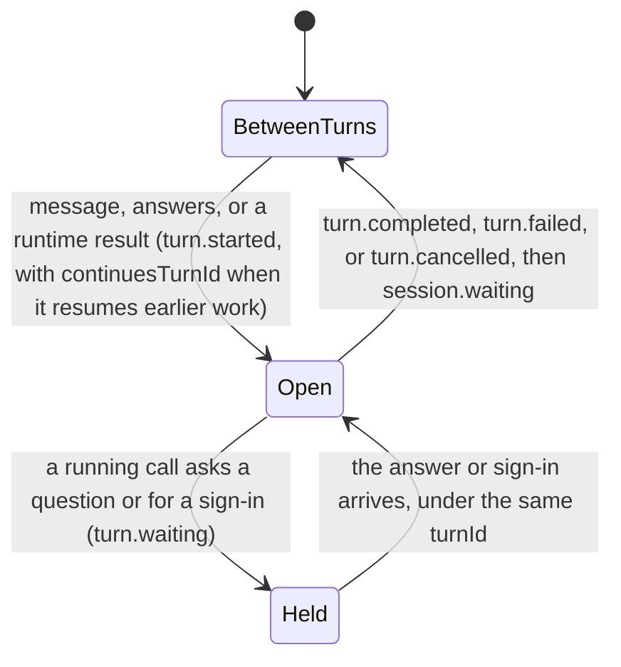
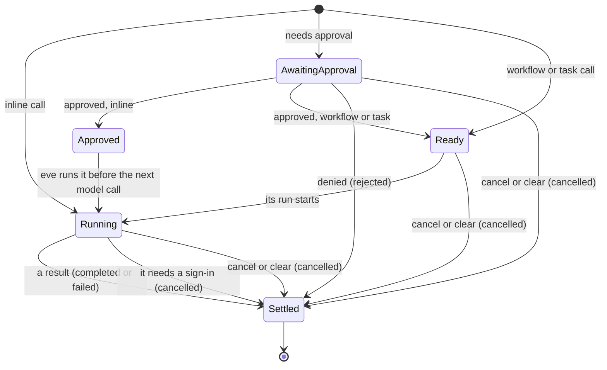
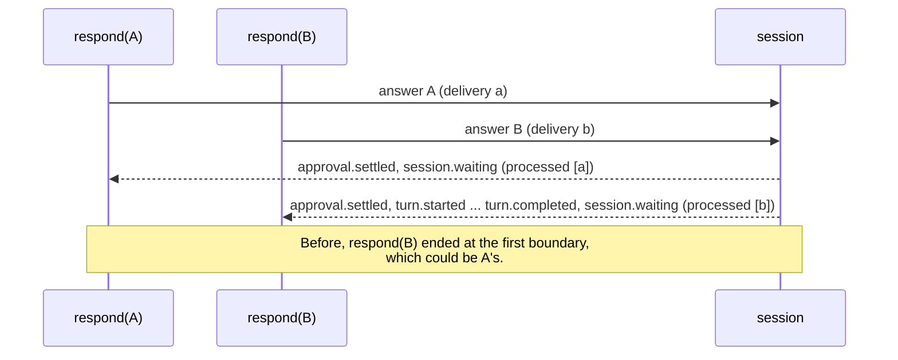
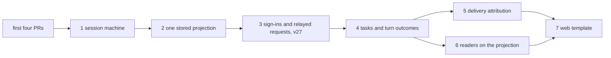

# One source of truth for session state

## Summary

eve works out where a session stands in many places. On the server, pending work lives in ten
durable records, and the code that changes a record also has to emit the matching stream event.
Web chat, `eve dev`, `respond()`, Slack task cards, evals, and ACP each read those events with
their own rules, and they disagree. A subagent that fails shows as failed in the chat but
completed in ACP, and an eval that checks for a completed call passes.

This plan gives each piece of session state exactly one owner:

- **A session machine** is the only code that changes pending work or builds lifecycle events.
- **A session projection** is folded from the events the machine publishes. It answers every
  lifecycle question, on the server and in every reader, with the same code.
- **Private records** hold what the stream never shows. Each is keyed by an ID the projection
  tracks and is dropped when its owner closes.
- **Caches** are written in one place.

The stream states the facts readers used to guess, and every reader asks the projection instead
of folding events itself. The work lands in the seven PRs listed under
[Implementation plan](#implementation-plan).

## Starting point

This plan assumes these four PRs have merged:

| PR    | What it establishes                                                                                                                                                                                    |
| ----- | ------------------------------------------------------------------------------------------------------------------------------------------------------------------------------------------------------ |
| #3878 | Stable part IDs for text and reasoning; authorization parts matched by `attemptId`; replayed tool events no longer reopen settled approvals                                                            |
| #3879 | One conversation client: hooks and `EveAgentStore` return `ConversationState` (messages plus turns, inputs, tasks, and agent sessions), with canonical `conversation` beside a custom reducer's `data` |
| #3880 | `eve dev` runs on `EveAgentStore`                                                                                                                                                                      |
| #3965 | A task call's tool part keeps running until `task.settled`                                                                                                                                             |

After them, web chat and `eve dev` share one fold of turns, inputs, and tasks in
`ConversationState`. Everything else is unchanged: the server keeps the records below and
publishes stream version 26, and the other readers fold raw events.

## Problem

### Many copies of the same state

```text
┌─ server: ten records ────────┐           ┌─ readers, each with its own rules ───────────┐
│ pending input batches        │           │ web chat      message reducer's part.state   │
│ coordination batch           │           │ eve dev       transcript toolState           │
│ deferred step input          │           │ respond()     ClientSession TurnSegment      │
│ workflow tool runs           │  events,  │ store status  EveAgentStore helpers          │
│ approval grants              │  built in │ task cards    task-card fold                 │
│ emission state               │  16 files │ evals         derive-run-facts               │
│ relayed requests             │  ───────▶ │ ACP           the adapter's event switch     │
│ pending sign-ins             │           │                                              │
│ approval candidates          │           │ web chat and eve dev share the               │
│ task table                   │           │ ConversationState fold for turns,            │
│                              │           │ inputs, and tasks, but not calls             │
│ idle check: probes raw keys  │           └──────────────────────────────────────────────┘
└──────────────────────────────┘
```

| Question                                     | Where eve answers it                                                                                                                                                                                                                                     |
| -------------------------------------------- | -------------------------------------------------------------------------------------------------------------------------------------------------------------------------------------------------------------------------------------------------------- |
| Is a turn open? Is the session idle?         | emission state, the cached `DurableSessionState.turn`, `isSessionStateIdleForHandoff`, `ConversationState.activeTurnId`, `TurnSegment`, `EveAgentStore` status, `derive-run-facts`, the ACP adapter                                                      |
| What is pending?                             | pending input batches, the coordination batch, deferred step input, workflow tool runs, relayed requests and the cached `hasProxyInputRequests`, pending sign-ins, approval candidates, the task table, client inputs, message parts, task-card blockers |
| Where does a call stand?                     | the pending batches and run registry, the task table, `part.state`, `eve dev`'s `toolState`, client task calls, task cards, `derive-run-facts`, the ACP adapter                                                                                          |
| Which turn or call does something belong to? | emission state, `TurnDeliveryIdsKey` (messages only), the client's settlement buffering, `agentCallTurns`                                                                                                                                                |

### Where readers disagree

Three ordinary situations, as each reader reports them today:

| What happened                                  | Web chat (`part.state`)                   | `eve dev`            | Task cards                    | ACP                               | Evals                                                   |
| ---------------------------------------------- | ----------------------------------------- | -------------------- | ----------------------------- | --------------------------------- | ------------------------------------------------------- |
| A subagent fails                               | `output-error`                            | error                | `failed`                      | `completed`, as soon as it starts | `calledTool` sees `completed`; `noFailedActions` passes |
| The user or a policy denies a call             | `output-denied`                           | denied               | `failed`                      | `failed`                          | `noFailedActions` fails the run                         |
| A turn is cancelled while a workflow tool runs | `input-available`, so it shows as running | error: "interrupted" | `working`, on a finished card | `pending`                         | `pending`                                               |

Task cards here means the `TaskCardView` that channel renderers draw. Each row has one cause:

- **A task call has two results.** Its `action.result` is the start receipt the model reads, and
  its outcome arrives later in `task.settled`. The conversation reducer and task cards wait for
  `task.settled`. ACP and the eval tool-call facts take the receipt.
- **A denial has two encodings.** The user's denial is `rejected`, and a policy's is `failed`
  with `TOOL_EXECUTION_DENIED`. The message reducer checks both. Task cards and ACP report both as
  failures, and `noFailedActions` counts both.
- **A stopped call has no result.** Cancelling a turn emits `turn.cancelled` and drops the call's
  run record. Each reader decides on its own what a call without a result means.

### Why they drift

1. **Changing a record and emitting its event are separate statements.** Lifecycle events are
   built in 16 files. Every site that changes a record must also emit, and some don't.
2. **Records keep copies of public facts.** Relayed requests store each request's coordinates,
   kind, and question. The task table stores calls and outcomes. Approval candidates store
   settlements. Each copy is parsed, validated, and closed by hand: relayed requests at five
   sites, and sign-ins at two, plus supersession.
3. **A record tracks whether its events went out.** Approval candidates carry `eventEmitted` and
   `pendingEventEmitted` flags. The tool loop emits every unmarked entry, then marks it.
4. **Readers re-derive from raw events.** Each reader above maps results with its own rules. The
   message reducer folds a second call lifecycle into `part.state`, and `agentCallTurns` assigns a
   child session's turns to calls by counting messages.
5. **Status is inferred from shape.** The handoff idle check probes five raw keys and three
   registries. Nothing writes one of those keys, `eve.harness.pendingWorkflowInterrupt`.

Besides the disagreements above, these cause user-visible bugs:

- `clear` leaves approvals answerable, so a later answer runs a call from the cleared context.
- A workflow call can dispatch while its approval is open. #3983 added a filter for this.
- Approvals are replayed through the AI SDK, so new input waits behind an approval batch.
- Answering some of a step's approvals emits no boundary, so `respond()` waits for the rest.
- Cancelling a turn clears relayed requests without an event, and so does a task run that
  finishes on its own. Readers keep showing those requests as answerable.
- A relayed request carries the child session's coordinates, so clients attach it to the root's
  first message.
- An answer's events carry the delivery IDs of the message that started the parked turn, so
  `respond(B)` can stop at a sibling answer's boundary.

### Recent fixes in the same area

As of 2026-09-30, these PRs fix symptoms of the same problem one at a time. Each is right to
land now, and the plan keeps its tests as regressions. After the plan, each kind of bug has one
place it could come from:

| PR                                    | Status               | What went wrong                                                                                                                     | Where the plan covers it                                                                                      |
| ------------------------------------- | -------------------- | ----------------------------------------------------------------------------------------------------------------------------------- | ------------------------------------------------------------------------------------------------------------- |
| #4083, #4084 (for #4079, repro #4081) | open                 | A task or workflow run that ended, or a cancelled turn, dropped its relayed questions without `input.resolved`                      | PR 1: `finishRun` and `cancel` emit every withdrawal. #4083 changes the cancellation code shown below         |
| #3953                                 | merged               | A `serve` tool's `ctx.reply()` left its pending questions open                                                                      | PR 1: the same withdrawal path                                                                                |
| #3762 (repro #3759)                   | merged; repro open   | A rejected approval answer parked without `session.waiting`, so the client waited for a boundary                                    | PR 1: a partial answer returns the session to waiting. PR 5: a boundary lists every accepted delivery         |
| #4027 (repro #4026)                   | open                 | When one delivery approved two batches, only the first call ran                                                                     | PR 1: `TurnState` replaces the pending batches and the deferred step input                                    |
| #3716 (repro #3714)                   | open                 | With several approval batches pending, a text answer such as "approve" was deferred                                                 | PR 1: the same                                                                                                |
| #3892 (for #3891)                     | open repro           | A step that also called a blocking workflow skipped the approval response policy                                                    | PR 1: one `decide` transition for every approval. It ports the #3494 adversarial suite, where the repro lives |
| #3983                                 | merged               | A workflow call could dispatch while its approval was open                                                                          | PR 1: calls dispatch only once ready                                                                          |
| #3903, #3901, #3987 (for #3899)       | merged, open, closed | On resume, memory or instructions moved the approval off the last message the AI SDK reads, so the approved call was skipped        | PR 1: eve runs approved calls itself instead of replaying approvals through the AI SDK                        |
| #3941                                 | open                 | A parent kept one batch of routes per child, so the answer to a subagent's earlier request never arrived                            | PR 3: private routes keyed by `requestId`                                                                     |
| #4001                                 | merged               | `agent.started` was published by a side step whose state changes were discarded                                                     | PR 1: only a transition's events are published, through `commit`                                              |
| #3789                                 | merged               | Relayed events skipped the parent's hooks                                                                                           | PR 1: `commit` publishes its own and relayed events the same way                                              |
| #3980                                 | merged               | Channel activity counted a local agent's turn as its caller's, so the caller looked done early; a remote agent's row stayed running | PR 2 and PR 5: task cards read the projection, and agent calls match turns by delivery ID                     |

## Design

### Four kinds of state

Every durable piece of session state is exactly one of these:

| Kind           | What                                                                                                                                              | Written by                                 |
| -------------- | ------------------------------------------------------------------------------------------------------------------------------------------------- | ------------------------------------------ |
| Machine state  | `TurnState`: the open turn and its deliveries, parked steps and their calls, the prompt, queued input, task results the model hasn't read, grants | The session machine only                   |
| Projection     | `SessionProjection`: turns, inputs, tasks, calls, sign-ins                                                                                        | Folding the events the machine publishes   |
| Private record | What readers never see, keyed by an ID the projection tracks: relay routes, sign-in attempts, task runs, approval candidates                      | The machine; dropped when its owner closes |
| Cache          | A derived value for a reader that can't load the session, such as `hasProxyInputRequests`                                                         | The save function                          |

A record with its own status, or a flag recording whether an event went out, is none of these.

### One fold, every reader

The readers in the first diagram become small consumers of one fold. The server stores the
projection with each step, clients carry it in `ConversationState`, and evals and ACP fold a
run's events through the same function:

```text
  message, answers, results, cancel, clear
                       │
                       ▼
┌─ session machine ────────────────────────────┐
│ transition(view, input) → { turn, events }   │ ──▶ TurnState and private records
└──────────────────────┬───────────────────────┘
                       │ events
                       ▼
┌─ protocol/session-projection.ts ───────────────────────────────────────────────────────┐
│ foldSession(projection, event)                                                         │
│ callStatus · openInputs · signInState · reachedBoundary · isIdle                       │
└────────────┬───────────────────────────────┬───────────────────────────────┬───────────┘
             │ stored with each step         │ in ConversationState          │ a run's events
             ▼                               ▼                               ▼
┌─ server ─────────────────┐   ┌─ clients ──────────────────┐   ┌─ evals and ACP ────────┐
│ the machine's view       │   │ toolCallState, part.state  │   │ run facts, assertions  │
│ handoff idle check       │   │ respond() and send() ends  │   │ ACP tool call updates  │
│ hasProxyInputRequests    │   │ EveAgentStore status       │   └────────────────────────┘
│ Slack task cards         │   │ web chat, eve dev, hooks   │
└──────────────────────────┘   └────────────────────────────┘
```

Each reader keeps only its presentation. Web chat, `eve dev`, task cards, and ACP map one call
status onto their own vocabulary, so the three rows in
[Where readers disagree](#where-readers-disagree) read the same everywhere.

### Invariants

1. Only the session machine writes `TurnState` and builds lifecycle events. Callers publish what
   a transition returns.
2. The stored projection is the fold of every event the session publishes, its own and relayed
   ones. It is saved with the step that published them.
3. A private record exists only while the projection shows its owner open. Closing the owner
   means emitting its event, and the record is dropped with it.
4. Every lifecycle question is answered by the projection. `TurnState` answers only what the
   stream doesn't carry, such as which calls wait to dispatch.
5. Caches are computed in the save function.

`pnpm guard:invariants` enforces invariants 1 and 2. The check fails if code outside the machine
imports turn-state writers or lifecycle event constructors, or if code outside the commit path
writes the stored projection. It also keeps transitions pure, so a transition decides only from
its view and its input:

```js
// scripts/guard-invariants.mjs (sketch)
forbidImports({
  from: ["#harness/session-machine/state.js", "#harness/session-machine/events.js"],
  outside: "packages/eve/src/harness/session-machine/",
});
forbidInFile("packages/eve/src/harness/session-machine/transitions.ts", {
  imports: ["#execution/*", "#runtime/*", "node:*"], // no I/O
  calls: ["Date.now", "new Date", "randomUUID"], // time and IDs arrive in the input
});
```

### The session machine

The machine is one directory. Its transition list reads as the lifecycle:

```text
harness/session-machine/
  state.ts        TurnState and its codec (private to the directory)
  events.ts       lifecycle event builders (private to the directory)
  view.ts         SessionView: turn state, stored projection, private records
  transitions.ts  every lifecycle transition
  commit.ts       publish, fold, prune, save: the only way state changes
protocol/session-projection.ts   the fold, shared with every reader
```

```ts
// harness/session-machine/transitions.ts (sketch)
export const transitions = {
  receive, // a message or answers arrive: open a turn, or join the open one
  decide, // approval decisions: approve, deny, or grant once()
  parkStep, // a model response with calls that can't all settle now
  dispatch, // ready workflow and task calls start their runs
  settle, // a call's result; commit the step once every call has one
  requireSignIn, // a call needs a sign-in: settle it cancelled, ask for the sign-in
  completeSignIn, // a sign-in callback: complete it before the turn it resumes
  relay, // a child's question or sign-in, passed up under the served call
  routeAnswer, // an answer to a relayed request: forward it, resolve it here
  finishRun, // a task or workflow run ends: settle its calls, withdraw its requests
  finishTurn, // nothing left to run: close the turn, or hold it for running calls
  cancel, // the turn is cancelled: settle, withdraw, close
  clear, // the context is cleared: settle, withdraw everything, empty history
} satisfies Record<string, (view: SessionView, input: never) => Transition>;
```

```ts
interface SessionView {
  readonly turn: TurnState;
  readonly projection: SessionProjection;
  readonly records: PrivateRecords;
}

/** What every transition returns. Nothing else changes session state. */
interface Transition {
  readonly turn: TurnState;
  readonly records?: Partial<PrivateRecords>; // new private data, such as a relay route
  readonly events: readonly LifecycleEvent[];
}
```

Every durable step has the same shape. `step` loads the view and hands it to a callback, which
runs the step's effects, such as tools, model calls, or run commands, and returns a transition.
The callback passes the effects' results into the transition, and effects must be safe to repeat,
because a step that fails is retried from the start. `commit` does the rest:

```ts
// harness/session-machine/commit.ts (sketch)
export async function step(
  input: SessionStepInput,
  run: (view: SessionView) => Promise<Transition>,
) {
  const view = await loadView(input);
  return await commit(view, await run(view), input.publish);
}

async function commit(view: SessionView, t: Transition, publish: Publish) {
  for (const event of t.events) await publish(event); // stream, channel, hooks, instrumentation
  const projection = prune(t.events.reduce(foldSession, view.projection));
  return {
    turn: t.turn,
    projection,
    records: dropClosed({ ...view.records, ...t.records }, projection),
  };
}
```

Cancelling a turn shows the difference. Today (from `execution/settle-cancelled-turn-step.ts`,
trimmed):

```ts
await publishFromSessionStep(step, {
  // Only turn.cancelled and session.waiting.
  publish: (emit) => emitCancelledTurn(emit, getHarnessEmissionState(durableState)),
  updateSession: (session, emissionState) => ({
    session: setHarnessEmissionState(
      clearPendingSessionLimitPrompt(
        clearAllProxyInputRequests(
          commitCancelledCoordinationBatch(
            removeBlockingWorkflowToolRuns({ ...session, outputSchema: undefined }, owningTurnId),
          ),
        ),
      ),
      emissionState,
    ),
  }),
});
```

Four pieces of state are cleared, and none of it reaches the stream. Each reader decides for
itself what happened to the running call and to the relayed question, which is the third row of
the table above. With the machine:

```ts
// execution/settle-cancelled-turn-step.ts
export async function settleCancelledTurnStep(input: SessionStepInput) {
  "use step";
  return await step(input, async (view) => cancel(view));
}

// harness/session-machine/transitions.ts
function cancel(view: SessionView): Transition {
  const { turnId } = view.turn.open;
  return {
    turn: { ...view.turn, open: undefined, prompt: undefined },
    events: [
      ...openInputs(view.projection).map(inputWithdrawn), // input.resolved "cancelled"
      ...openSignIns(view.projection).map(signInWithdrawn), // authorization.completed "failed"
      ...unsettledCalls(view.projection, turnId).map(callStopped), // action.result "cancelled", PR 4
      turnCancelled(turnId),
      sessionWaiting(),
    ],
  };
}
```

`commit` then drops the relay routes and run records whose requests and calls those events
closed. Nothing is cleared by hand. Cancelling a task takes the same shape: `finishRun` is the
one transition for a cancelled task and for a run that ends on its own. Today the second path
clears the run's relayed requests without an event.

### Turn and call lifecycles

A turn:



A call. The machine tracks each parked call through these states, and the projection reports
the status readers see:



| Machine state                 | Projection status                                                      |
| ----------------------------- | ---------------------------------------------------------------------- |
| awaiting approval             | `awaiting-input`                                                       |
| approved, ready, running      | `running`                                                              |
| settled                       | the result's status: `completed`, `failed`, `rejected`, or `cancelled` |
| no result when its turn ended | `interrupted`                                                          |

The turn's phase is derived, never stored. If a ready or running workflow or task call exists,
the turn waits on the runtime. If only approvals or the prompt remain, the turn closes. Otherwise
the model runs.

### What the records become

| Record                                                 | Public part, read from the projection                 | Private part that remains                                                                                | Plan PR |
| ------------------------------------------------------ | ----------------------------------------------------- | -------------------------------------------------------------------------------------------------------- | ------- |
| The six pending-work records                           | pending approvals, calls, and turns                   | `TurnState`                                                                                              | 1       |
| Approval candidates (`eve.runtime.hitl.approvalState`) | settlements                                           | responder progress (candidate, expiry, sign-in challenges), owned by its request                         | 1       |
| `TurnDeliveryIdsKey`                                   | none                                                  | `TurnState.turn.deliveryIds`                                                                             | 1       |
| `eve.harness.pendingWorkflowInterrupt`                 | none                                                  | none; deleted                                                                                            | 1       |
| Pending sign-ins (`eve.runtime.pendingAuthorization`)  | open or closed, name, `callIds`, coordinates          | attempt by `attemptId`: callback URL, resume value, principal, connection instance                       | 3       |
| Relayed requests (`eve.runtime.proxyInputRequests`)    | open or closed, kind, coordinates, question, `callId` | route by `requestId`: continuation token, inbox, remote binding, workflow-ask route                      | 3       |
| Task table (`eve.taskTable`)                           | name, kind, calls and outcomes                        | run by `taskId`: hook token, run ID, held commands, usage, `resumable`; unread results go to `TurnState` | 4       |
| Slack task cards (`channel.state`)                     | calls, statuses, blockers                             | presentation: titles, bounded inputs, summaries, times                                                   | 2       |

Derived questions become one-liners:

```ts
export const isIdle = (v: SessionView) => v.turn.queued === undefined && !hasOpenWork(v.projection);

export const hasProxyInputRequests = (v: SessionView) =>
  openInputs(v.projection).some((input) => v.records.routes[input.requestId] !== undefined);
```

The projection is folded on every event, not only for a particular reader, and includes relayed
events. Before it's stored in every session, its pruning must be bounded. A fold that keeps every
turn that continues another would grow without limit in a long-lived session. It keeps one link
from each open turn to its root instead.

### What the stream states

Each fact the session knew but the stream left unstated becomes a new field or value. No existing
field changes meaning unless a new field marks it, so a reader can tell from each event which
rules its writer followed; see [Compatibility](#compatibility).

| Fact                                    | Readers guessed                                                      | Now                                                                                      | PR  |
| --------------------------------------- | -------------------------------------------------------------------- | ---------------------------------------------------------------------------------------- | --- |
| Withdrawals                             | a cancelled turn or a finished run dropped relayed requests silently | `input.resolved` `cancelled`, `authorization.completed` `failed`, before the owner ends  | 1   |
| Which calls a sign-in stops             | every unsettled call in a closed turn with an open sign-in           | `authorization.required.callIds`; each settles `cancelled` with `AUTHORIZATION_REQUIRED` | 3   |
| Which attempt a completion closes       | `attemptId`, else the approval candidate, else the latest attempt    | `attemptId` required on both events                                                      | 3   |
| When a sign-in callback completes       | the completion could follow the resumed turn's start                 | it precedes that turn, at the asking turn's coordinates                                  | 3   |
| Which call a relayed request serves     | the parent adopted the child's call and guessed its status           | relayed `input.requested.callId`, with the served call's coordinates and `taskId`        | 3   |
| Which turn a turn continues             | settlements buffered between turns                                   | `turn.started.continuesTurnId`                                                           | 4   |
| Which turn runs an approved call        | the open turn, or else the next                                      | every approved resolution in `input.resolved` carries `resumeTurnId`                     | 4   |
| Calls eve stops                         | no result; readers inferred from the turn's status                   | `action.result` status `cancelled`, with `TURN_CANCELLED` or `CONTEXT_CLEARED`           | 4   |
| Policy denials                          | `failed` with `TOOL_EXECUTION_DENIED`                                | `rejected`                                                                               | 4   |
| Approval policy events' coordinates     | they named the turn about to start                                   | they name the step that asked                                                            | 4   |
| Which deliveries a boundary finishes    | an answer's read ended at the first boundary                         | `session.waiting` and `turn.waiting` carry `processedDeliveryIds`, `[]` when none        | 5   |
| Which answer an event belongs to        | the IDs of the message that started the parked turn                  | `meta.answerDeliveryIds`; `meta.deliveryIds` keeps its meaning                           | 5   |
| Which parent call a child's turn serves | counting the child's user messages                                   | `task.started.deliveryId` for agent calls; the child stamps it                           | 5   |

With delivery attribution, overlapping answers each reach their own boundary:



### Clients and eve's other readers

**The conversation state.** `ConversationState` is the message list plus the projection. The
conversation reducer runs the message reducer for content and the shared fold for lifecycle, on
the same object:

```ts
// protocol/session-projection.ts: the one fold, used by the server and every reader
export interface SessionProjection {
  readonly activeTurnId?: string;
  readonly turns: Readonly<Record<string, SessionTurn>>;
  readonly inputs: Readonly<Record<string, SessionInput>>; // by requestId
  readonly tasks: Readonly<Record<string, SessionTask>>;
  readonly calls: Readonly<Record<string, SessionCall>>; // by callId
  readonly authorizations: Readonly<Record<string, SessionAuthorization>>; // by attemptId
}
export declare function foldSession<S extends SessionProjection>(state: S, event: StreamEvent): S;

// client/conversation-state.ts
export type ConversationState = EveMessageData &
  SessionProjection & {
    /** Agent sessions this client followed; only a client knows these. */
    readonly agents: Readonly<Record<string, ConversationAgentSession>>;
  };

// client/conversation-reducer.ts
export function reduceConversation(state: ConversationState, event: ClientEvent) {
  const next = { ...state, messages: reduceMessages(state, event).messages };
  return isStreamEvent(event) ? foldSession(next, event) : reduceClientEvent(next, event);
}
```

Every lifecycle question a UI asks is then a short selector over those fields:

```ts
export const openInputs = (c: ConversationState) =>
  Object.values(c.inputs).filter((input) => input.status === "open");

export const pendingSignIns = (c: ConversationState) =>
  Object.values(c.authorizations).filter((attempt) => attempt.status === "required");
```

The public type can keep `calls` and `authorizations` out, as the draft in #3986 does, so eve can
change how it stores them. The selectors read them either way.

**Tool call state.** Today `eve dev` maps a tool call from the part, the inputs, the tasks, and
the store's status, in its own function (from `cli/dev/tui/transcript-parts.ts`, trimmed):

```ts
export function toolState(part, conversation, working: boolean): ToolState {
  const task = conversation.tasks[part.toolMetadata?.eve?.taskId ?? ""];
  if (task?.calls[part.toolCallId]?.status === "working") return { status: "running" };
  const state = settledToolState(part, conversation); // a switch over part.state and the inputs
  return state.status === "running" && !working
    ? { status: "error", errorText: "interrupted" }
    : state;
}
```

Web chat has no such function. Its renderers switch on `part.state`. With the projection, both ask
one selector, which takes the status from the projection and the content from the part:

```ts
export function toolCallState(
  conversation: ConversationState,
  callId: string,
  { streaming = true } = {},
): ToolCallState {
  const status = callStatus(conversation, callId, { streaming });
  const part = findToolPart(conversation.messages, callId);
  return { status, output: part?.output, errorText: part?.errorText };
}
```

The store always keeps canonical `conversation` beside a custom reducer's `data`, so this works
with any reducer.

**`part.state`.** Each tool call in `messages` is an AI SDK `UIMessage` part, and its `state`
field is what AI SDK renderers such as `useChat` UIs switch on:

```ts
{
  type: "dynamic-tool",
  toolCallId: "call_1",
  toolName: "deploy",
  input: { service: "api" },
  state: "input-available", // or approval-requested, output-available, output-error, output-denied
}
```

Today the message reducer computes `state` from events with its own rules, a second call
lifecycle beside the projection. That's how the stopped call in the table above stays
`input-available`. With the projection, the reducer keeps content (text, reasoning, tool input,
and output) and writes `state` from the call's status:

| Projection status                                    | `part.state`                                                  |
| ---------------------------------------------------- | ------------------------------------------------------------- |
| `running`                                            | `input-available`, or `output-available` with `partial: true` |
| `awaiting-input`                                     | `approval-requested`                                          |
| `completed`                                          | `output-available`                                            |
| `failed`, `cancelled`, or `interrupted` (turn ended) | `output-error`, with `errorText` saying why                   |
| `rejected`                                           | `output-denied`                                               |

`output-error` also covers calls eve stopped, and `toolCallState` tells stopped calls from failed
ones. A call interrupted because the reader's stream stopped remains a read-time judgment, passed
as `streaming`.

**Reads and store status.** `respond()` and `send()` resolve at the first boundary whose
`processedDeliveryIds` lists their delivery. A boundary without the field comes from an older
writer, so they end there, as today. `EveAgentStore` status is a check over the same facts. Only
sends not yet accepted, HTTP errors, and aborts stay local:

```ts
function storeStatus(conversation: ConversationState, sends: LocalSends): EveAgentStoreStatus {
  if (sends.error !== undefined) return "error";
  if (sends.resuming) return "resuming";
  if (sends.unaccepted > 0) return "submitted";
  return sends.accepted.some((id) => !reachedBoundary(conversation, id)) ? "streaming" : "ready";
}
```

**Agent calls.** A call's child turns are the turns stamped with the delivery it sent. Today
(from `client/conversation-state.ts`, trimmed):

```ts
// The k-th message the session received came from the task's k-th call; a turn without
// a message of its own continues the previous call.
for (const message of conversation.messages) {
  if (message.role !== "user") continue;
  const callId = callIds[index++];
  ...
}
```

With the projection:

```ts
const callTurns = (child: ConversationState, deliveryId: string) =>
  Object.values(child.turns).filter((turn) => turn.deliveryIds.includes(deliveryId));
```

**Task cards, evals, and ACP.** These don't hold a `ConversationState`, but they read the same
projection. Task cards read the stored one on the server. Evals and ACP fold the events they
receive through `foldSession` and ask `callStatus`. ACP today (from `acp/adapter.ts`, trimmed):

```ts
case "action.result": {
  // A task call's receipt reads as completed; task.settled and turn.cancelled are ignored.
  const status = event.data.status !== "completed" || result.isError ? "failed" : "completed";
  await notifyUpdate(client, sessionId, { sessionUpdate: "tool_call_update", toolCallId, status });
}
```

With the projection:

```ts
const before = session.projection;
session.projection = foldSession(before, event);
for (const callId of changedCalls(before, session.projection)) {
  const status = ACP_STATUS[callStatus(session.projection, callId)];
  await notifyUpdate(client, sessionId, {
    sessionUpdate: "tool_call_update",
    toolCallId: callId,
    status,
  });
}

// ACP has no statuses for denied or stopped calls.
const ACP_STATUS: Record<SessionCallStatus, ToolCallStatus> = {
  running: "in_progress",
  "awaiting-input": "pending",
  completed: "completed",
  failed: "failed",
  rejected: "failed",
  cancelled: "failed",
  interrupted: "failed",
};
```

`noFailedActions` becomes a filter over the same statuses, so a failed subagent fails the run
and a denial doesn't:

```ts
const projection = result.events.reduce(foldSession, initialSessionProjection());
const failed = Object.keys(projection.calls).filter(
  (id) => callStatus(projection, id) === "failed",
);
```

`eve dev` already reads `ConversationState`. Its `toolState` becomes a relabeling of
`toolCallState`, and its diagnostics log reads failures from the projection instead of raw
`action.result` events, so a failed subagent reaches the log too.

## Compatibility

Sessions aren't ported to the new state. This follows existing practice:

- The session checkpoint version went from 4 to 10 between #3263 and #3970. #3970's changeset
  tells users to keep each session's owning deployment available until the session finishes.
- An incompatible handoff leaves the session on its current owner (#4032).
- On Vercel, old sessions keep running old code. Sessions park after each turn instead of
  ending (#3817), so an old deployment may serve a thread indefinitely.
- Local and in-place upgrades have no old code to keep. The next delivery fails with
  `Unsupported session checkpoint. Start a new session on this deployment.`

PRs 1–4 change durable state, so each bumps `SESSION_CHECKPOINT_VERSION`, as does any later PR
that changes it.

### Older writers

A new reader can't tell which code wrote an event from the response it arrived in:

- `x-eve-stream-version` is the serving deployment's own constant (`createSessionStreamResponse`).
- The events come from the session's stream in shared storage (`getRun(sessionId).getReadable()`),
  written by the owner, which runs on the deployment that started it. Because incompatible
  handoffs are refused, the newest deployment routinely serves streams an older owner writes.
- After a compatible handoff, the successor owner writes to the same stream, so one stream can
  have two writers.
- The serving deployment creates the delivery ID that `send()` and `respond()` return. The owner
  stamps the events.

A `respond()` that trusted the header and filtered by its answer's ID would skip every event a v26
owner wrote and wait until the session ended. eve already handles shape changes per event:
`normalizePersistedMessageStreamEvent` recognizes events from before v25 by their shape. Changes
in meaning follow the same idea. Each change identifies itself on the event it affects:

1. **No existing field or value changes meaning on its own.** A new rule gets a new field, or a
   new field on the same event marks it, as a relayed request's `callId` marks its new
   coordinates.
2. **A new field is optional only if readers use its presence alone.** If readers must treat its
   absence as meaningful, new writers always write it, empty if need be, such as
   `processedDeliveryIds: []`. Then absence means an older writer and nothing else.
3. **`meta` holds facts the writer stamps on events, and readers use them only when present.**
   Anything whose absence means something goes in the event's `data`, where the type can require
   it. Channel adapters also see events before they're stamped, so they read `data` but not
   `meta`.

Readers keep a fallback for each fact an older writer leaves out:

| Fact                                     | From an older writer | Fallback                                                |
| ---------------------------------------- | -------------------- | ------------------------------------------------------- |
| Withdrawals                              | none                 | requests stay open, as today                            |
| `authorization.required.callIds`         | absent               | every unsettled call in the turn the sign-in closes     |
| `attemptId`                              | absent               | the approval candidate, else the latest attempt         |
| Relayed `input.requested.callId`         | absent               | the child's call and coordinates, as today              |
| `resumeTurnId` on an approved resolution | absent               | the open turn, else the next                            |
| Calls eve stops                          | no result            | the turn's status: `cancelled` for a cancelled turn     |
| Policy denials                           | `failed`             | `failed` with `TOOL_EXECUTION_DENIED` reads as a denial |
| `processedDeliveryIds`                   | absent               | the first boundary ends a read, as today                |
| `meta.answerDeliveryIds`                 | absent               | a read keeps every event, as today                      |
| `task.started.deliveryId`                | absent               | `agentCallTurns` counts the child's user messages       |

Each PR that adds a fact adds its fallback, with a test that reads an older writer's events. The
drafts don't have these yet. In #4044, `callStatus` shows an approved call that's still running
as awaiting approval when `input.resolved` has no `resumeTurnId`, which no v26 writer includes.
The fallbacks stay until eve decides when to stop reading older writers.

The header still protects older clients. PR 3 adds values they would misread, such as a
`cancelled` result, so it moves the header to 27, and older clients reject the stream instead of
rendering it wrong. No reader uses the header to decide what an event means. If PRs 3–5 span
releases, a release needs a new header version only if it adds values an older client would
misread.

## Performance

The plan stores about the same state, shaped differently: today's records hold the same pending
requests, calls, and runs that the stored projection and private records will. What needs care:

- **Stored projection size.** Every session step copies and diffs the whole durable state
  (`withSessionStateDelta`), so the server's projection must stay proportional to open work.
  Pruning keeps open work, one link from each open turn to its root, and what task cards need
  until their final update. PR 2 adds a test that folds a long generated session and asserts the
  stored projection stays under a fixed size.
- **Step count.** `commit` runs inside the steps that already exist, so no durable steps are
  added. PR 1 compares step counts for a fixed scenario before and after.
- **Client folds and selectors.** The client keeps the full history, but only lifecycle events
  touch the projection; text deltas don't. Selectors run on every render, so the fold indexes
  inputs by `callId`, and selectors memoize on the maps they read, which keep their identity
  between text deltas. Writing `part.state` uses a call-to-message index, so a `turn.cancelled`
  updates its calls without rescanning the transcript. The fold reports which calls an event
  changed, so ACP and task cards don't compare every call on every event.
- **Stream size.** A few events per cancel or clear, one field per boundary, and one `meta` field
  on the events an answer produces.

## Testing

- **Transitions are pure,** so most lifecycle tests are unit tests that call a transition and
  check the state and events it returns.
- **A stream contract checker** (`internal/testing/session-contract.ts`) is a test oracle and
  doesn't ship in eve. It checks each event against the stream before it, and the session's state
  after each step. The tool-loop fixture and the tests that read a session's workflow stream run
  it.
- **Generated sessions** run seeded random sequences of messages, answers, steering, results,
  sign-ins, cancels, and clears against a model that calls tools at random. CI runs a fixed seed
  set.
- **Each rule lands with the PR that makes it hold:**

  | Rule                | A reader may rely on                                                        | PR  |
  | ------------------- | --------------------------------------------------------------------------- | --- |
  | `turn-order`        | one turn at a time, content inside its turn, nothing after the session ends | 1   |
  | `resolved-twice`    | a request resolves once                                                     | 1   |
  | `open-after-owner`  | no request or sign-in outlives its task, turn, a clear, or the session      | 1   |
  | `state-agreement`   | the projection shows exactly what the session awaits                        | 2   |
  | `unasked-sign-in`   | a call settled for a sign-in is named by an `authorization.required`        | 3   |
  | `own-coordinates`   | events name only turns and calls this stream announced                      | 3   |
  | `unsettled-call`    | a completed turn leaves no call without an outcome                          | 4   |
  | `delivery-boundary` | every accepted delivery is listed by a boundary's `processedDeliveryIds`    | 5   |

- **Older writers:** each fallback has a unit test over an older writer's events, such as a
  `respond()` over boundaries without `processedDeliveryIds`.
- **End-to-end evals** cover approvals (partial, separate, stale, and policy-settled answers),
  sign-ins, relayed questions, task and workflow calls, cancellation, and `respond()` with
  overlapping answers. TUI smoke tests cover `eve dev`.

Drafts of most of these changes exist in #4018, #4044, #3986, and #3977. Against them, 1,500
generated seeds pass locally. On 200 seeds, removing the cancel withdrawals fails 15% of seeds,
removing the clear withdrawals fails 40%, and removing the sign-in ask beside an approval fails
55%.

## Implementation plan

Seven PRs, each of which builds, passes CI, and carries its own tests, docs, and changeset. They
land in order, except that PRs 5 and 6 are independent of each other. Each PR that adds a stream
fact also adds its fallback for older writers.



Sizes are rough net estimates for production code in `packages/eve/src`.

| #   | PR                            | Area                 | Est. net     |
| --- | ----------------------------- | -------------------- | ------------ |
| 1   | Session machine               | server               | −700 to −800 |
| 2   | One stored projection         | server, client       | 0 to +100    |
| 3   | Sign-ins and relayed requests | stream (v27), server | −190 to −280 |
| 4   | Tasks and turn outcomes       | stream, server       | −50 to −200  |
| 5   | Delivery attribution          | stream, client       | −180 to +50  |
| 6   | Readers on the projection     | client, evals, ACP   | −60 to −220  |
| 7   | Web template                  | template             | template     |

In total, production code in `packages/eve/src` should shrink by roughly 850–1,700 lines. Tests
should shrink by about 3,000, mostly suites written against the replaced records. These are
estimates, not measurements. PR 3 is the best calibration point: after the session machine, it
is the largest deletion, and it exercises the whole derived-record pattern.

### 1. Session machine

- `TurnState` replaces the six pending-work records. The machine is the only writer of turn state
  and the only builder of lifecycle events, and `commit` is the only way state changes.
- `TurnDeliveryIdsKey` moves into `TurnState.turn`. Approval candidates' transitions move into the
  machine, and their emitted flags go.
- Adds `isIdle` and the guards, and deletes the interrupt key.
- Cancel, clear, and a run ending report every withdrawal with events the stream already has.
- eve runs approved calls itself, before the model reads their results, and `ctx.messages` is the
  model's history. `clear` withdraws approvals, the prompt, and sign-ins. A partial answer returns
  the session to waiting. Workflow calls dispatch only once ready.
- Adds the contract checker and generated sessions, test only, with the first three rules.
- Regression tests hold three cases: a policy pass that settles nothing doesn't start a turn, an
  approval's first decision stands, and a declined session-limit prompt resolves once. Ports the
  #3983 approved-workflow scenarios, the approval-resume suite, and the #3494 adversarial suite.

This is the largest PR. Most of its diff moves code out of `tool-loop.ts` or deletes records, so
it reviews best commit by commit: extract the machine, move each record onto it, then delete the
old paths.

### 2. One stored projection

- Moves the conversation reducer's turn, input, and task fold into
  `protocol/session-projection.ts`, and adds calls and sign-ins. `ConversationState` carries it.
- The server folds every published event, own and relayed, into the stored projection, with
  bounded pruning.
- The handoff idle check and Slack task cards read it, and the task-card fold goes. Task cards
  keep their presentation details, such as titles and summaries, in channel state.
- Adds the `state-agreement` rule.

### 3. Sign-ins and relayed requests

- Sign-ins: `authorization.required.callIds`, `attemptId` required on both events, a stopped
  call settles `cancelled` with `AUTHORIZATION_REQUIRED` (header v27), and a callback's
  completion precedes the turn it resumes. Pending sign-ins become projection plus private
  attempts, and supersession emits `failed`.
- Relayed requests: a relayed `input.requested` names the served call in `callId` and uses its
  coordinates and `taskId`, and the parent stops recording the child's call. Relayed requests
  become projection plus private routes, and `hasProxyInputRequests` is derived. `turn.waiting`
  follows a relayed request only while the parent has an open turn.
- Regression tests hold three cases: a call that needs a sign-in beside an approval asks for it, a
  sign-in doesn't close a turn while runs work, and an approved call that needs a sign-in leaves
  its step. Adds the `unasked-sign-in` and `own-coordinates` rules.

### 4. Tasks and turn outcomes

- The task table splits three ways: lifecycle comes from the projection, unread results move into
  `TurnState`, and runs become private records.
- `turn.started.continuesTurnId`, and `resumeTurnId` on every approved resolution.
- `cancelled` with `TURN_CANCELLED` or `CONTEXT_CLEARED` for calls eve stops, `rejected` for a
  policy's denials, and approval policy events at the step that asked.
- Adds the `unsettled-call` rule.

### 5. Delivery attribution

- `session.waiting` and `turn.waiting` carry `processedDeliveryIds`, always, and an answer's
  events carry `meta.answerDeliveryIds`, including answers forwarded to a child session or a
  workflow run. The next boundary lists an accepted delivery that the session ignores.
- `task.started.deliveryId` for agent calls, carried by the remote-agent protocol. The projection
  records each turn's delivery IDs, and `agentCallTurns` stops counting.
- `ClientSession` reads end at the boundary that lists their delivery, or at the first boundary
  from an older writer, and `TurnSegment` goes. `EveAgentStore` status is derived, and its helpers
  and follow-up counters go.
- Adds the `delivery-boundary` rule.

### 6. Readers on the projection

- `toolCallState(conversation, callId, { streaming })` and `signInState`, exported from
  `eve/client`, `eve/react`, `eve/vue`, and `eve/svelte`. `ConversationInput` gains `callId` and
  `resumeTurnId`, and tool parts keep their labels and error codes.
- The message reducer writes `part.state` from the projection.
- `eve dev`'s tool states and diagnostics, `derive-run-facts`, eval assertions, and the ACP adapter
  read the projection. `noFailedActions` counts `failed` calls only. `eve dev` resumes only root
  tool approvals in the next turn.

### 7. Web template

- Folds activity under each stretch of an answer, and shows requests inline where they arrived.
- Builds on the public selectors, with no copied helpers.

## Alternatives considered

**A decider.** `decide(view, input)` would return events and effects as data,
`evolve(view, event)` would be the only way state changes, and a runtime would run the effects.
Every decision would be pure, including timing and duplicate answers, and `state-agreement`
would hold by construction.

It isn't worth the cost. The pending-work path interleaves decisions with user code: response
policies, connection authorization, approved tool runs, and sandbox staging. A decider splits
each decision at every call into user code. That takes internal events that are saved but never
streamed, and more durable steps unless effects are batched. A streaming model call also has to
publish content outside `decide`. The design above keeps effects inline. Its risks are an effect
without a matching event and a transition that reads more than its input. The guards and the
checker cover those, and effects must be safe to repeat in either design.

**Stamping each event with its writer's version.** A `meta.streamVersion` on every event would
tell readers which rules an event follows. Every reader rule would then branch on version
numbers, each change in meaning would need its own number, and readers outside eve would need
the table. Additive fields put the evidence on the event the rule reads.

**Routing reads to the owner's deployment.** The header would then match the writer, but routing
needs deployment pinning, which not every environment has, and a stream can still have two
writers after a handoff.

## Out of scope

- Instrumentation, tracing, and channel adapters' event handlers other than task cards.
- A call cut off mid-step. An abort discards the step's state, so the projection reads such a
  call as `cancelled` from its cancelled turn.
- A cancel during a step that already reported progress. That needs the step to checkpoint what
  it reported.
- Stream loss. A reader can only call its running calls `interrupted`.

## Open questions

- Approval candidates' audit history also guards candidate-ID uniqueness and duplicate
  responses. Can the projection answer both?
- The model's `[Tasks]` note lists idle, resumable tasks. Should it read the projection or the
  private task runs?
- The next boundary lists an ignored delivery. While a turn runs, that's the turn's end. Should
  an ignored answer get an earlier boundary?
- `continuesTurnId` is absent on a fresh turn from any writer. Is the older-writer guess,
  buffering settlements between turns, harmless on new streams, or should every `turn.started`
  carry the field?
- PR 4 changes what approval policy events' coordinates mean, and nothing on those events marks
  the change. If any reader places them by their coordinates, a new field should mark it or carry
  the new coordinates.
- `TaskCardStatus` has no `rejected` or `interrupted`. Should it gain them, or should task cards
  map them onto its current values?
- When can readers drop their fallbacks for older writers? Parked sessions have no natural end
  (#3817), so this is a policy decision.
- Instrumentation scope records (`instrumentationInputScopes`, `instrumentationActionScopes`) are
  keyed by requests and calls. Are they dropped when their owners close?

## Related documents

This document replaces the design notes in the drafts it supersedes:

- `research/turn-state.md` (#4018);
- `research/session-stream-contract.md` (#4044);
- `research/server-session-projection.md` (#4044).

`research/client-conversation-state.md` (#3922) describes the `ConversationState` the first four
PRs implement. `research/slack-task-cards.md` describes the task cards PR 2 moves onto the
projection.
