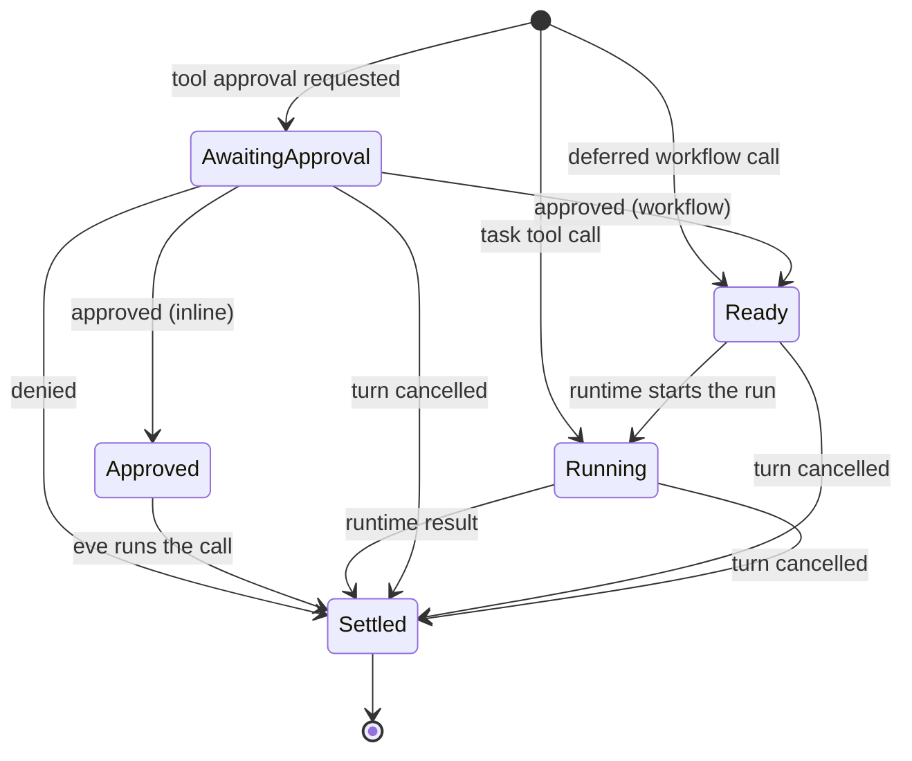

# Turn state

A session's pending work used to live in six records, each persisted and
cleaned up on its own:

| Record                     | What it held                                                              |
| -------------------------- | ------------------------------------------------------------------------- |
| pending input batches      | one approval batch per model step, with the response messages it withheld |
| pending coordination batch | workflow and task calls waiting to dispatch                               |
| deferred step input        | input that arrived while an approval batch was unresolved                 |
| workflow tool run registry | running workflow calls and the runs that serve them                       |
| approval grants            | `once()` approvals already given in this context                          |
| harness emission state     | the turn's ID, sequence, and step index, with `""` meaning between turns  |

Each operation had to update every record it touched, and several didn't.
`clear` left approvals answerable, so a later answer ran a tool call from the
cleared context. A workflow call could dispatch while its approval was still
open ([#3983](https://github.com/vercel/eve/pull/3983) added a dispatch filter for that case). Approval responses were
replayed through the AI SDK, which needed the approval messages at the tail of
history, so new input was deferred behind them and batches resolved one at a
time.

This change keeps all of that in one durable record, `TurnState`, and moves
every lifecycle transition, and the stream events it produces, into one module.
The event protocol keeps its shape; what changes is listed under
[Observable changes](#observable-changes).

[Session stream contract](./session-stream-contract.md) builds on this: it
makes every close report what it dropped, states the relations readers used
to infer, and holds every stream to a checked contract.

## Primitives

```text
session ─ turn ─ parked step ─ call ─ wait
```

- **Turn.** At most one turn is open. Its `turnId`, `sequence`, and
  `stepIndex` are the coordinates every event carries. No open turn means the
  session is between turns.
- **Parked step.** One model response whose calls have not all settled. It
  holds the response messages back from history and commits them exactly once,
  when every call has a result.
- **Call.** One tool call in a parked step: `awaiting-approval`, `approved`,
  `ready`, `running`, or `settled`. Only `ready` workflow calls dispatch.
- **Wait.** What a call or the session is blocked on. An approval is a wait on
  its call; the session-limit prompt is a wait on the session.

## Durable state

Everything lives under one key, `eve.session`, in `session.state`:

```ts
interface TurnState {
  version: 1;
  started: boolean; // session.started was emitted
  sequence: number; // the open turn's sequence, or the next turn's
  turn?: { id: string; stepIndex: number; outputStarted?: boolean };
  steps: ParkedStep[]; // oldest first
  prompt?: LimitPrompt; // the session-limit continuation prompt
  queued?: StepInput; // input held behind the prompt or an approval policy phase
  grants: string[]; // approval keys granted in this context
}
```

`DURABLE_SESSION_VERSION` moves to 2 and `SESSION_CHECKPOINT_VERSION` to 11.
A session checkpointed by an earlier version fails with the existing "start a
new session" error, and a handoff from an earlier deployment keeps the session
on its current owner. Legacy-driver imports carry over only the turn
coordinates.

Relayed requests (questions and approvals a task's run passes up) and pending
sign-ins keep their own keys beside the turn state.

## Call lifecycle



eve runs approved inline calls itself, in the turn that resumes them and
before the model reads their results, instead of replaying the approval
through the AI SDK. A call eve runs this way sees the history the model
reads in `ctx.messages`. Because no approval message has to sit at the tail
of history, input no longer waits behind an approval batch, and every batch
answered in one delivery resumes together.

## Turn phase

The phase is derived, never stored:

- A `ready` or `running` workflow or task call exists: the turn waits on the
  runtime, which dispatches the calls and collects their results.
- Only approvals or the prompt remain: the turn closes with
  `input.requested`, `turn.completed`, and `session.waiting`.
- Otherwise the model runs, or the turn completes.

## Scope closes

| Operation | Effect on the turn state                                                                                                                                 |
| --------- | -------------------------------------------------------------------------------------------------------------------------------------------------------- |
| cancel    | settles the turn's unsettled calls, and every approved, ready, or running call, as cancelled; commits their steps; drops the prompt and relayed requests |
| clear     | drops every parked step, the prompt, queued input, grants, and pending sign-ins, and empties history. Requests relayed from live tasks stay routable     |
| reset     | ends the session, as before                                                                                                                              |

These closes change state without reporting what they dropped. The stream
contract change adds those reports.

## Event projection

| Transition                 | Event                                                        |
| -------------------------- | ------------------------------------------------------------ |
| turn opened                | `session.started` (once), `turn.started`, `message.received` |
| step started               | `step.started`                                               |
| step parked with approvals | `input.requested`                                            |
| approvals decided          | `input.resolved`, and `action.result` for a rejection        |
| call settled               | `action.result`                                              |
| turn closed                | `turn.completed`, `turn.failed`, or `turn.cancelled`         |
| session idle               | `session.waiting`                                            |

## Observable changes

- `clear` withdraws pending approvals, the session-limit prompt, and pending
  sign-ins. An answer to one of them no longer runs the earlier call.
- An approved call runs before the model's next call reads its result.
  Approvals answered in one delivery resume in one model call, and an approved
  call runs before the session-limit prompt stops the model, since running it
  spends no model tokens.
- Workflow calls dispatch only once they are `ready`. #3983's dispatch filter
  becomes the call lifecycle.
- Sessions from an earlier eve version can't resume on, or hand off to, this
  one.

## Replaced modules

`pending-input-batches`, `input-requests`, `coordination` (batch state),
`workflow-dispatch`, `workflow-tool-runs`, `hitl/pending-input-resolution`,
`hitl/approval-input-requests`, `hitl/session-limit-input-requests`,
`emission-state`, `active-turn-id`, `cancelled-turn-emission`, and
`execution/session/pending-turn-state`. The new modules are `turn-state`,
`parked-calls`, `runtime-calls`, `session-lifecycle`, and `step-input`.

Production code in `packages/eve/src` shrinks by about 850 lines (+2,468,
−3,318). Tests shrink by about 6,700 lines: suites written against the
replaced records go. This change ports four of #3983's cases into
`turn-state.integration.test.ts`. The session stream contract change restores
the rest of #3983's suite, the approval-resume suite, and the
[#3494](https://github.com/vercel/eve/issues/3494) adversarial suite against the turn state.

## Known gaps

- Closes don't report what they drop; see the stream contract change.
- Four approval suites return only with the stream contract change, and that
  change also fixes a regression they catch here: a response-policy pass that
  settles no approval opens a turn and calls the model. The two changes
  should land together.
