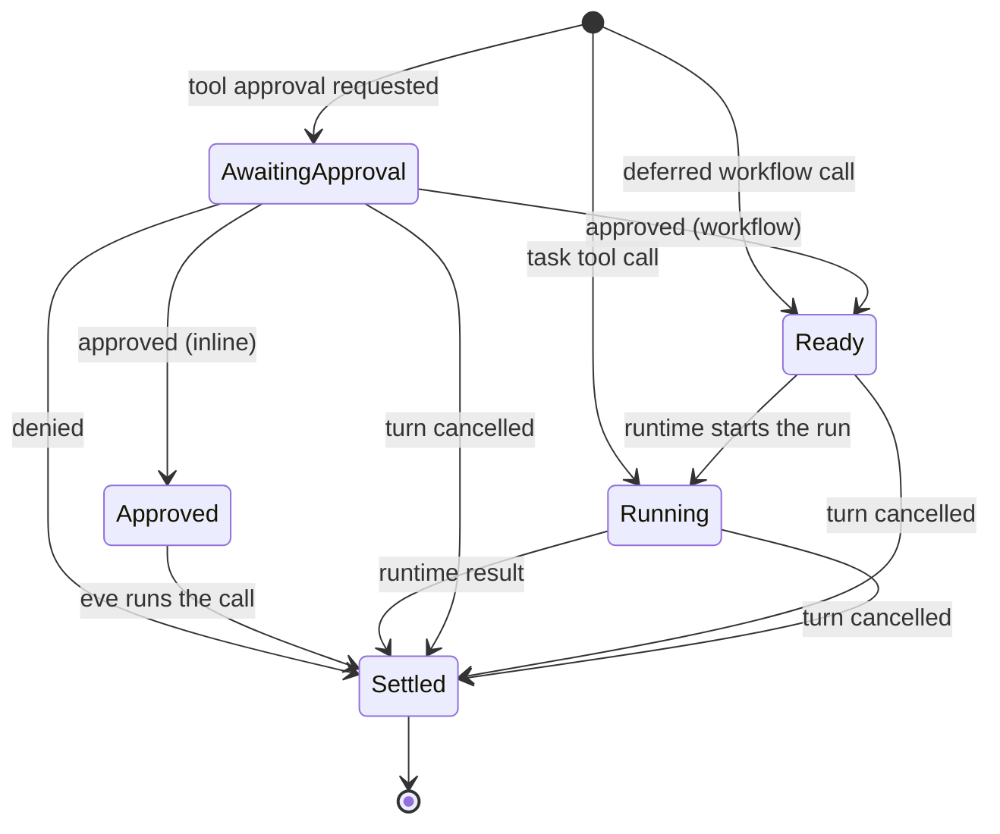

# Turn state

One durable record owns every piece of pending work a session holds, and one
module owns every lifecycle transition and the stream events they project.
It replaces the independently persisted mechanisms (pending input batches,
the pending coordination batch, deferred step input, the blocking workflow
run registry, approval grants, and the harness emission state) whose partial
cleanup produced bugs such as `clear` leaving approvals answerable and
workflow calls dispatching before approval.

The public event protocol is unchanged, with one intended fix: `clear`
revokes pending approvals, the session-limit prompt, and parked calls.

## Primitives

```text
Session ─ context ─ turn ─ step ─ call ─ wait
```

- **Turn**: at most one open turn. Its `id`, `sequence`, and `stepIndex` are
  the coordinates every event carries. No open turn means the session is
  between turns; there is no empty-string sentinel.
- **Parked step**: one model response whose calls have not all settled. It
  owns the withheld response messages and its calls, and commits to history
  exactly once, when every call has a result.
- **Call**: one tool call inside a parked step. It is `awaiting-approval`,
  `approved`, `ready`, `running`, or `settled`. Only `ready` workflow calls
  dispatch.
- **Wait**: what blocks a call or the turn. An approval is a wait on its
  call; a session-limit prompt is a wait on the session.

## Durable state

Everything lives under one key, `eve.session`, in `session.state`:

```ts
interface TurnState {
  version: 1;
  started: boolean; // session.started was emitted
  sequence: number; // open turn's sequence, or the next turn's
  turn?: { id: string; stepIndex: number; outputStarted?: boolean };
  steps: ParkedStep[]; // oldest first
  prompt?: LimitPrompt; // session-limit continuation prompt
  queued?: StepInput; // input held behind a prompt or an approval policy phase
  grants: string[]; // approval keys granted in this context
}
```

`DURABLE_SESSION_VERSION` moves to 2 and `SESSION_CHECKPOINT_VERSION` to 10,
so sessions checkpointed by the previous shape fail with the existing "start
a new session" error, and a deployment handoff across the change keeps the
session on its current owner. Legacy-driver imports carry over only the turn
coordinates.

## Call lifecycle



eve executes approved inline calls itself instead of replaying approval
responses through the AI SDK. That removes the tail-message constraint that
forced deferred input, one-batch-at-a-time resolution, and moving approval
messages between batches.

## Turn phase

Derived, never stored:

- a `ready` or `running` workflow or task call exists → the turn waits on the
  runtime (execution dispatches and collects results);
- only approvals or the prompt remain → the turn closes
  (`input.requested` → `turn.completed` → `session.waiting`);
- otherwise the model runs, or the turn completes.

## Scope closes

| Operation | Effect                                                                                                                                                   |
| --------- | -------------------------------------------------------------------------------------------------------------------------------------------------------- |
| cancel    | settle the turn's unsettled calls as cancelled and commit their steps; drop the prompt and proxy requests; `turn.cancelled`                              |
| clear     | drop every parked step, the prompt, queued input, grants, and pending authorization; empty history. Questions from live tasks and children stay routable |
| reset     | ends the session (unchanged)                                                                                                                             |

## Event projection

| Transition                 | Event                                                        |
| -------------------------- | ------------------------------------------------------------ |
| turn opened                | `session.started` (once), `turn.started`, `message.received` |
| step started               | `step.started`                                               |
| step parked with approvals | `input.requested`                                            |
| approvals decided          | `input.resolved`, `action.result` (rejected)                 |
| call settled               | `action.result`                                              |
| turn closed                | `turn.completed` / `turn.failed` / `turn.cancelled`          |
| session idle               | `session.waiting`                                            |

## Replaced modules

`pending-input-batches`, `input-requests`, `coordination` (batch state),
`workflow-dispatch`, `workflow-tool-runs`, `hitl/pending-input-resolution`,
`hitl/approval-input-requests`, `hitl/session-limit-input-requests`,
`emission-state`, `active-turn-id`, `cancelled-turn-emission`,
`execution/session/pending-turn-state`.
